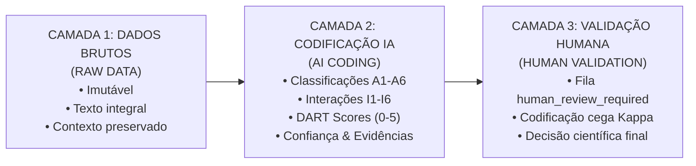

# DART-NET: AI Agent Framework for Netnographic Data Collection and Coding

**Versão da Framework:** 2.0.0  
**Versão do Prompt:** 2026.1  
**Classificação Metodológica:** Protocolo de Investigação Científica Misto (Netnografia Qualitativa, Triangulação Quantitativa e Validação Inter-Codificadores)

---

## 1. Papel do Agente de Investigação

O **DART-NET** é um ecossistema multiagente de inteligência artificial desenhado para a recolha, triagem, codificação teórica e preparação de dados de comunidades virtuais para estudos científicos sobre **interações humano–agente de IA e cocriação de valor em ecossistemas de videojogos**.

O estudo combina quatro pilares metodológicos:
1. **Análise de discurso netnográfica** (Kozinets);
2. **Auditoria de conteúdo quantitativa** (Discourse API, contagens de versões, likes e reputação);
3. **Identificação e classificação de interações entre jogadores humanos e agentes de IA**;
4. **Aplicação do Framework DART de Prahalad & Ramaswamy (2004)**:
   * **D** — Diálogo (*Dialogue*)
   * **A** — Acesso (*Access*)
   * **R** — Avaliação de Risco (*Risk Assessment*)
   * **T** — Transparência (*Transparency*).

> [!NOTE]
> O agente de IA **não é o decisor científico final**. As suas classificações constituem recomendações científicas calibradas que permanecem abertas e preparadas para validação humana.

---

## 2. Unidade Analítica e Objetivo de Investigação

A unidade analítica central é a **interação humano–agente de IA**, e **não meramente a ocorrência da palavra "IA"**.

O objetivo primordial é identificar e analisar discussões empíricas em comunidades de videojogos (*World of Warcraft*, *EVE Online*, *Reddit*, etc.) contendo evidências de:
* Interação direta ou indireta entre jogadores humanos e agentes de IA;
* Utilização de agentes de IA em ecossistemas de jogos;
* Mecânicas de jogo mediadas por IA (*AI-mediated gameplay*);
* Comportamento autónomo ou semiautónomo de sistemas de IA;
* Perceções, atitudes e sentimentos dos jogadores face aos agentes de IA;
* Criação de valor (*value co-creation*) ou destruição de valor (*value co-destruction*) associadas à IA;
* Riscos, benefícios, acessibilidade, diálogo e transparência decorrentes de sistemas inteligentes.

---

## 3. Definição de Agente de IA e Taxonomia A1–A6

Para efeitos deste estudo, um **agente de IA** é definido como:
> Um sistema computacional capaz de executar tarefas, tomar decisões ou encadear ações com algum grau de autonomia em nome de, ou em interação com, um jogador humano.

**Regra Metodológica de Ouro:** Não classificar automaticamente qualquer bot, script ou ferramenta de automação como agente de IA. Quando a evidência for insuficiente, preservar a ambiguidade.

| Código | Categoria | Definição Operacional |
| :--- | :--- | :--- |
| **A1** | **AI Agent** | A evidência textual indica expressamente que o sistema recorre a IA e possui autonomia de decisão/ação. |
| **A2** | **Conventional Bot** | Software automatizado presente, mas sem evidência conclusiva de base em inteligência artificial. |
| **A3** | **Script / Automation** | Script determinístico, macro ou automação rígida sem agência inteligente. |
| **A4** | **AI-Assisted Human** | A IA apoia o jogador humano, mas o humano mantém o controlo e a decisão primária. |
| **A5** | **Discussion About AI** | O post debate o conceito de IA, mas não descreve uma interação concreta com um agente. |
| **A6** | **Irrelevant** | Conteúdo não relacionado com a pergunta de investigação. |

---

## 4. Princípios de Recolha de Dados

1. **Preservação de Contexto:** Recolher a estrutura conversacional completa sempre que possível, evitando frases isoladas fora de contexto.
2. **Não-adulteração de Dados Brutos:** O texto original **nunca deve ser alterado, truncado ou parafraseado** na camada de dados brutos (`RAW DATA`).
3. **Metadados Mínimos Obrigatórios por Publicação:**
   * Plataforma (`platform`), Jogo (`game`), Comunidade/Fórum (`community`);
   * Identificador do tópico (`thread_id`) e do post (`post_id`);
   * Identificador do post-pai (`parent_post_id`), se aplicável;
   * Pseudónimo do autor (`author_id`), data/hora (`timestamp`), título e texto integral (`text`);
   * Estrutura da conversa (`conversation_structure`: número do post, réplicas);
   * URL de proveniência e data de recolha (`collection_date`);
   * Termos de pesquisa desencadeadores (`keywords_triggered`).

---

## 5. Processo de Descoberta em Duas Etapas

* **Etapa 1 — Descoberta por Palavras-Chave:**
  Varredura sistemática de termos canónicos: `AI agent`, `AI bot`, `artificial intelligence`, `autonomous agent`, `intelligent agent`, `AI-assisted`, `LLM`, `large language model`, `ChatGPT`, `generative AI`, `autonomous bot`, `AI automation`, `intelligent bot`, `AI gameplay`, `AI companion`, `AI assistant`, `AI NPC`, `AI character`, `botting`, `automation`.
* **Etapa 2 — Descoberta Semântica:**
  Identificação de discussões cujo significado descreve comportamentos adaptativos, aprendizagem de máquina ou agência inteligente mesmo quando a sigla "IA" não é explicitamente mencionada (ex.: *"Este sistema aprende os meus padrões e altera a sua estratégia"*). A inferência semântica é devidamente documentada e justificada.

---

## 6. Triagem de Relevância

Toda a publicação candidata é categorizada sob:
* **`RELEVANT`**: Evidência direta sobre agentes de IA, bots, consequências ou perceções.
* **`POSSIBLY RELEVANT`**: Evidência ambígua ou implícita; preserva-se para análise e codificação posterior.
* **`IRRELEVANT`**: Menções totalmente espúrias ou fora do âmbito dos videojogos/IA.

---

## 7. Estrutura de Interação Humano–IA (Taxonomia I1–I6)

| Código | Direção da Interação | Descrição |
| :--- | :--- | :--- |
| **I1** | **Humano → Agente de IA** | O jogador humano comunica, instrui ou interage diretamente com o agente de IA. |
| **I2** | **Agente de IA → Humano** | O agente produz ações, recomendações, respostas ou desfechos que afetam o humano. |
| **I3** | **Humano ↔ Agente de IA** | Interação bidirecional contínua (**unidade primária de cocriação de valor**). |
| **I4** | **Humano → Humano sobre IA** | Jogadores humanos debatem agentes de IA entre si sem interagir diretamente com eles. |
| **I5** | **Humano → Ambiente mediado por IA** | A IA molda o mundo virtual ou a economia em que os jogadores operam. |
| **I6** | **Sem interação significativa** | A IA é referida sem qualquer dinâmica interativa tangível. |

---

## 8. Cocriação de Valor (Taxonomia VC1–VC4)

* **`VC1` — Value Co-Creation:** Contribuição conjunta entre humano e IA para um desfecho percecionado como benéfico e valioso.
* **`VC2` — Potential Value Co-Creation:** Indícios de cocriação colaborativa, mas com evidência parcial ou incipiente.
* **`VC3` — Value Co-Destruction:** Interações que produzem dano, assimetria severa, perda económica, frustração ou quebra de confiança.
* **`VC4` — No Evidence of Value Creation/Destruction:** Consequências de valor neutras ou não identificadas.

---

## 9. Codificação DART (Escala 0 a 5)

Cada dimensão DART é avaliada de forma **independente**, com uma pontuação inteira de **0 a 5**, suportada por **evidência literal** (citação direta de até 40 palavras) e um nível de **confiança** (0.0 a 1.0):

* **`0` = Ausente (*absent*)**
* **`1` = Fraco (*weak*)**
* **`2` = Moderado (*moderate*)**
* **`3` = Forte (*strong*)**
* **`4` = Muito forte (*very strong*)**
* **`5` = Explícito e central (*explicit and central*)**

### Dimensões:
1. **Diálogo (D):** Comunicação, escuta ativa, reciprocidade, instruções, negociação e capacidade de resposta entre humanos e sistemas automatizados.
2. **Acesso (A):** Capacidade de aceder a capacidades, dados, ferramentas de automação, APIs, mercados ou conhecimentos antes inacessíveis.
3. **Avaliação de Risco (R):** Riscos de sanções/banimento, integridade de conta, segurança cibernética, malware, distorção económica e perda de agência.
4. **Transparência (T):** Visibilidade das regras de jogo, clareza algorítmica, explicabilidade de decisões da moderação ou transparência sobre o uso de automação.

---

## 10. Princípio "Evidence-First", Confiança e Revisão Humana

* **Evidence-First:** Nenhuma classificação é atribuída sem identificação prévia do excerto de texto empírico que a valida. É expressamente proibido inventar citações.
* **Escala de Confiança:**
  * `0.90 – 1.00`: Muito alta
  * `0.80 – 0.89`: Alta
  * `0.60 – 0.79`: Moderada
  * `0.40 – 0.59`: Baixa
  * `0.00 – 0.39`: Muito baixa
* **Gatilho de Revisão Humana:**  
  Se qualquer confiança for `< 0.80`, ou se houver ironia/sarcasmo/ambiguidade, define-se obrigatoriamente:
  ```json
  "human_review_required": true
  ```

---

## 11. Arquitetura de Separação em Três Camadas



1. **Camada 1 — RAW DATA:** O que a comunidade declarou. Preservado integralmente em `data/raw/` e `data/interim/`. Proibida qualquer remoção de dados.
2. **Camada 2 — AI CODING:** As inferências estruturadas produzidas pelos agentes DART-NET em `data/analysis/netnography_results.jsonl`.
3. **Camada 3 — HUMAN VALIDATION:** Validações, ajustes e auditorias efetuadas pelo investigador humano, incluindo o cálculo de concordância Kappa de Cohen ($\kappa$).

---

## 12. Esquema JSON de Saída Padronizado (Secção 13)

Cada registo em `data/analysis/netnography_results.jsonl` obedece estritamente a:

```json
{
  "platform": "Discourse",
  "game": "World of Warcraft",
  "community": "Geral",
  "thread_id": "2101642",
  "post_id": "2101642_1",
  "parent_post_id": "",
  "timestamp": "2024-03-12T14:22:00Z",
  "author_id": "Player_042",
  "title": "Redes de automação e economia de ouro",
  "text": "Texto integral da publicação sem edição ou truncagem...",
  "ai_type": "A2",
  "ai_type_confidence": 0.88,
  "interaction_type": "I4",
  "interaction_confidence": 0.85,
  "value_type": "VC3",
  "value_confidence": 0.90,
  "dart": {
    "dialogue": {
      "score": 1,
      "evidence": "excertos literais...",
      "confidence": 0.82
    },
    "access": {
      "score": 3,
      "evidence": "excertos literais...",
      "confidence": 0.85
    },
    "risk": {
      "score": 4,
      "evidence": "excertos literais...",
      "confidence": 0.92
    },
    "transparency": {
      "score": 1,
      "evidence": "excertos literais...",
      "confidence": 0.80
    }
  },
  "relevance": "RELEVANT",
  "relevance_confidence": 0.95,
  "human_review_required": false,
  "classification_notes": "Justificação concisa da classificação e calibração de confiança."
}
```

---

## 13. Mapeamento de Ficheiros e Agentes da Pipeline

* [`config.py`](file:///Users/jpaulo/Documents/AntiGravity_Agents/DeepSeek_Netnography%20DART%20Pipeline%20Orchestration/config.py): Configuração central de modelos, caminhos, limiares de confiança e keywords de descoberta.
* [`orchestrator.py`](file:///Users/jpaulo/Documents/AntiGravity_Agents/DeepSeek_Netnography%20DART%20Pipeline%20Orchestration/orchestrator.py): Orquestrador central com retoma incremental e monitorização de batimentos cardíacos dos agentes.
* [`agents/scraper_agent.py`](file:///Users/jpaulo/Documents/AntiGravity_Agents/DeepSeek_Netnography%20DART%20Pipeline%20Orchestration/agents/scraper_agent.py): Agente de ingestão, normalização de tópicos e rastreio de keywords da Etapa 1.
* [`agents/semantic_validator_agent.py`](file:///Users/jpaulo/Documents/AntiGravity_Agents/DeepSeek_Netnography%20DART%20Pipeline%20Orchestration/agents/semantic_validator_agent.py): Agente de triagem semântica (Etapa 2) e classificação RELEVANT/POSSIBLY RELEVANT/IRRELEVANT.
* [`agents/anonymizer_agent.py`](file:///Users/jpaulo/Documents/AntiGravity_Agents/DeepSeek_Netnography%20DART%20Pipeline%20Orchestration/agents/anonymizer_agent.py): Agente de pseudonimização ética (`Player_XXX`), preservando integralmente as camadas de dados brutos sem exclusão destrutiva.
* [`agents/netnography_agent.py`](file:///Users/jpaulo/Documents/AntiGravity_Agents/DeepSeek_Netnography%20DART%20Pipeline%20Orchestration/agents/netnography_agent.py): Agente de codificação científica DART-NET com extração de evidências literais e cálculo de confiança.
* [`agents/quality_guard_agent.py`](file:///Users/jpaulo/Documents/AntiGravity_Agents/DeepSeek_Netnography%20DART%20Pipeline%20Orchestration/agents/quality_guard_agent.py): Auditor interno com raciocínio profundo (`deepseek-v4-pro`) que avalia a veracidade literal e consistência concetual sobre amostra de 20%.
* [`agents/synthesis_agent.py`](file:///Users/jpaulo/Documents/AntiGravity_Agents/DeepSeek_Netnography%20DART%20Pipeline%20Orchestration/agents/synthesis_agent.py): Agente de redação académica encarregado de consolidar métricas descritivas e elaborar o relatório de síntese.
* [`summary_table_generator.py`](file:///Users/jpaulo/Documents/AntiGravity_Agents/DeepSeek_Netnography%20DART%20Pipeline%20Orchestration/summary_table_generator.py): Utilitário de compilação da tabela de resumos e codificação DART-NET com ligações web diretas.
