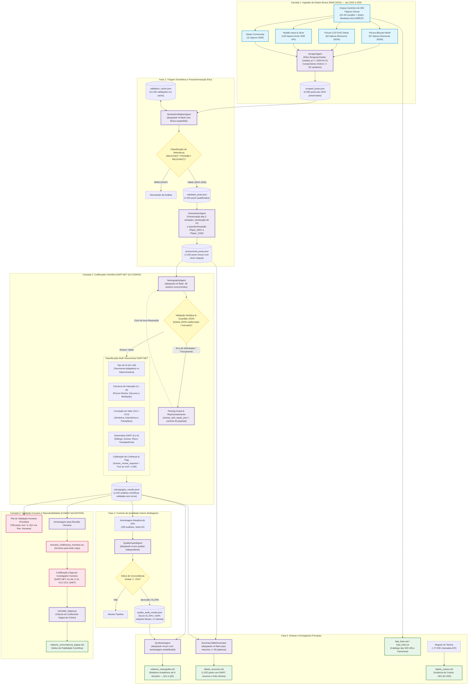

# Fluxograma da Pipeline Netnográfica DART-NET v3.0
## Interação Humano-IA e Cocriação de Valor em Ecossistemas de Videojogos

Este documento apresenta o fluxograma metodológico e arquitetural completo da pipeline multiagente de análise netnográfica baseada no Framework **DART-NET** (Prahalad & Ramaswamy, 2004; DART-NET 2026), integrando desde a extração de dados brutos pós-2024 até à validação inter-codificadores via Kappa de Cohen.

---

## Diagrama de Fluxo (Mermaid)

---

## Descrição das Fases da Pipeline DART-NET v3.0

1. **Fase 1: Ingestão Canónica e Filtro Temporal Estrito (RAW DATA)**
   * **Agente:** `ScraperAgent`
   * **Fontes:** 303 discussões canónicas catalogadas (Discourse WoW e EVE Online, Reddit `r/wow` e `r/Eve`, Steam Community).
   * **Regra Temporal:** `POST_MIN_DATE = "2024-01-01T00:00:00Z"`. Foram filtradas 8.999 mensagens, excluindo 1.248 posts pré-2024 e 1.266 posts curtos (< 50 carateres).
   * **Saída:** `data/interim/scraped_posts.json` (6.485 posts pós-2024 preservados na íntegra).

2. **Fase 2: Triagem Semântica e Sanitização Ética**
   * **Agentes:** `SemanticValidatorAgent` e `AnonymizerAgent`
   * **Ação:** Triagem semântica de relevância suportada pelo modelo `deepseek-v4-flash` com léxico expandido (LLM, MCP, Copilot, etc.). Pseudonimização ética (`Player_0001` a `Player_1032`) e sanitização de dados privados (PII), preservando as 3 camadas metodológicas intactas (Secção 14).
   * **Saída:** `data/processed/anonymized_posts.json` (1.032 posts únicos estritamente pós-2024).

3. **Fase 3: Codificação Qualitativa DART-NET e Parsing Guard (AI CODING)**
   * **Agente:** `NetnographyAgent` com módulo integrado `Parsing Guard & Reprocessing`
   * **Mecanismo de Tolerância a Falhas:** Incorporação da camada de reparação estrutural de JSON (`extract_and_repair_json`), proteção contra estouro de contexto para posts volumosos (truncamento de segurança no prompt a $\le 8.000$ carateres, preservando o texto original no ficheiro final) e rotina automática de reprocessamento em ciclo fechado. Recuperou **100% dos 224 posts afetados**, garantindo zero falhas residuais (`0` erros remanescentes) e integridade analítica total dos 1.032 posts.
   * **Ação Analítica:** Codificação multi-taxonómica via `deepseek-v4-flash`:
     * **Tipologia de IA (`A1` a `A6`)**: Distinção estrita de agentes de IA autónomos (A1) vs bots convencionais (A2), scripts (A3), humanos assistidos (A4) e discussões reflexivas (A5).
     * **Estrutura de Interação (`I1` a `I6`)**: Identificação dos fluxos direto (I1), agente-humano (I2), bidirecional (I3) e discurso social (I4).
     * **Cocriação de Valor (`VC1` a `VC4`)**: Mapeamento de cocriação simétrica (VC1), potencial cocriação assimétrica (VC2) e codestruição parasitária (VC3).
     * **Dimensões DART (0 a 5)**: Avaliação independente de Diálogo, Acesso, Risco e Transparência com evidência literal.
     * **Calibração de Confiança e Flag Humana**: Sinalização automática de `human_review_required: true` para casos com confiança < 0,80 ou ambiguidade.
   * **Saída:** `data/analysis/netnography_results.jsonl` (1.032 análises científicas validadas sem falhas de processamento).

4. **Fase 4: Controlo de Qualidade Interno Multiagente**
   * **Agente:** `QualityGuardAgent`
   * **Ação:** Amostragem cega e probabilística de 20% (206 análises) auditada pelo modelo de raciocínio `deepseek-v4-pro`. Validação da autenticidade literal de 100% das citações, coerência taxonómica e calibração DART.
   * **Resultado:** **Score Médio de 91,20%** (limiar crítico de $\ge 70\%$ superado amplamente; apenas 12 casos com alertas estritos de confiança).
   * **Saída:** `data/analysis/quality_audit_results.json`.

5. **Fase 5: Síntese e Entregáveis Finais**
   * **Agentes:** `SynthesisAgent` e `SummaryTableGenerator`
   * **Entregáveis:**
     * `output/relatorio_netnografia.md`: Relatório académico formal de 8 secções em português de Portugal, respondendo às 5 Questões de Investigação (QI1 a QI5) fundamentadas empiricamente.
     * `output/tabela_resumos.md`: Matriz com 1.032 registos (DART scores, Tipos IA, Interação, Valor, resumos $\le$ 50 palavras, temas $\le$ 8 palavras, links diretos e flag de revisão humana).
     * `output/lista_links.md` e `output/lista_links.txt`: Inventário canónico das 303 discussões catalogadas.
     * `output/tabela_custos.md`: Auditoria financeira de ~27.000 chamadas de API com custo consolidado de **~$21,50 USD**.

6. **Fase 6: Validação Humana e Reprodutibilidade (HUMAN VALIDATION)**
   * **Fila de Revisão Humana**: 799 posts (77,42%) priorizados para validação humana através da flag `⚠️ Sim`.
   * **Concordância Inter-Codificadores**: Amostra de validação para teste cego e cálculo estatístico do coeficiente Kappa de Cohen ($\kappa$).
   * **Saída:** `output/relatorio_concordancia_kappa.md`.

