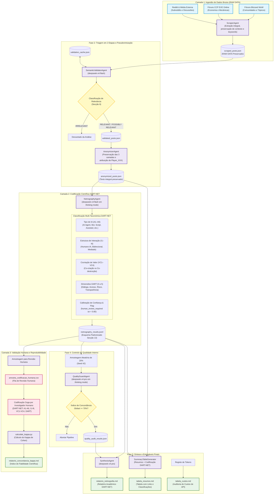

# Fluxograma do Plano de Implementação da Pipeline Netnográfica DART-NET v2.0

Este documento apresenta o fluxograma metodológico e arquitetural completo da pipeline multiagente de análise netnográfica baseada no Framework **DART-NET** (Prahalad & Ramaswamy, 2004; DART-NET 2026), integrando desde a extração de dados brutos até a validação inter-codificadores via Kappa de Cohen.

---

## Diagrama de Fluxo (Mermaid)

---

## Descrição das Fases da Pipeline DART-NET v2.0

1. **Fase 1: Ingestão e Preservação de Dados Brutos (RAW DATA)**
   * **Agente:** `ScraperAgent`
   * **Fontes:** Publicações de fóruns Discourse (WoW e EVE Online), subreddits e plataformas externas.
   * **Ação:** Extração preservando o texto original, contexto conversacional e identificando as palavras-chave desencadeadoras de descoberta (`keywords_triggered`).
   * **Saída:** `data/interim/scraped_posts.json` (Camada 1 preservada integralmente).

2. **Fase 2: Triagem Semântica e Sanitização Ética**
   * **Agentes:** `SemanticValidatorAgent` e `AnonymizerAgent`
   * **Ação:** Triagem de relevância tripartida (`RELEVANT`, `POSSIBLY RELEVANT`, `IRRELEVANT`) com calibração de confiança. Pseudonimização ética de autores (`author_id` -> `Player_XXX`) garantindo a não-exclusão dos ficheiros brutos conforme a regra de três camadas (Secção 14).
   * **Saída:** `data/processed/anonymized_posts.json`.

3. **Fase 3: Codificação Qualitativa DART-NET**
   * **Agente:** `NetnographyAgent`
   * **Ação:** Codificação teórica com `deepseek-v4-flash` (*thinking mode*):
     * **Tipologia de IA (`A1` a `A6`)**: Distinção estrita de agentes de IA vs bots convencionais e scripts.
     * **Estrutura de Interação (`I1` a `I6`)**: Identificação de fluxos unidirecionais, bidirecionais (`I3`) e mediados.
     * **Cocriação de Valor (`VC1` a `VC4`)**: Mapeamento de criação, potencial cocriação e codestruição de valor.
     * **Dimensões DART (0 a 5)**: Avaliação independente de Diálogo, Acesso, Risco e Transparência com citação literal (máx. 40 palavras).
     * **Calibração de Confiança e Flag Humana**: Atribuição automática de `human_review_required: true` se confiança `< 0.80` ou ambiguidade.
   * **Saída:** Base de dados incremental em `data/analysis/netnography_results.jsonl` (Esquema da Secção 13).

4. **Fase 4: Controlo de Qualidade Interno**
   * **Agente:** `QualityGuardAgent`
   * **Ação:** Amostragem cega de 20% avaliada por `deepseek-v4-pro` (*thinking mode*) validando a veracidade das citações literais, consistência concetual de A1-A6 e I1-I6, calibração DART (0-5) e sinalização da revisão humana. Limiar mínimo de aprovação $\ge 70\%$.
   * **Saída:** `data/analysis/quality_audit_results.json`.

5. **Fase 5: Síntese e Entregáveis Finais**
   * **Agentes:** `SynthesisAgent` e `SummaryTableGenerator`
   * **Entregáveis:**
     * `output/relatorio_netnografia.md`: Relatório científico formal incorporando as taxonomias DART-NET.
     * `output/tabela_resumos.md`: Tabela cruzada com posts, classificações DART-NET, flags de revisão humana, resumos e links diretos.
     * `output/tabela_custos.md`: Auditoria financeira de consumo da API DeepSeek.

6. **Fase 6: Validação Inter-Codificadores (Kappa de Cohen)**
   * **Ação:** Extração de amostra de auditoria humana cega para cálculo estatístico do coeficiente Kappa de Cohen ($\kappa$) comparando a codificação da IA com o investigador humano.
   * **Saída:** `output/relatorio_concordancia_kappa.md`.

