# Fluxograma da Pipeline Netnográfica DART-NET v3.0
## Interação Humano-IA e Cocriação de Valor em Ecossistemas de Videojogos

Este documento apresenta o fluxograma metodológico e arquitetural completo da pipeline multiagente de análise netnográfica baseada no Framework **DART-NET** (Prahalad & Ramaswamy, 2004; DART-NET 2026), integrando desde a extração de dados brutos pós-2024 até à validação inter-codificadores via Kappa de Cohen.

---

## Diagrama de Fluxo (Mermaid)

```mermaid
flowchart TD
    %% Estilos Globais
    classDef source fill:#e1f5fe,stroke:#0288d1,stroke-width:2px;
    classDef agent fill:#ede7f6,stroke:#512da8,stroke-width:2px;
    classDef decision fill:#fff9c4,stroke:#fbc02d,stroke-width:2px;
    classDef output fill:#e8f5e9,stroke:#2e7d32,stroke-width:2px;
    classDef validation fill:#fce4ec,stroke:#c2185b,stroke-width:2px;

    %% CAMADA 1: Ingestão de Dados Brutos
    subgraph FASE1 ["Camada 1: Ingestão de Dados Brutos (RAW DATA) — Jan 2024 a 2026"]
        CORPUS["Corpus Canónico de 303 Tópicos Únicos<br/>(A1-A5 curados + Query Booleana IA/LLM/MCP)"]:::source
        
        RAW_WOW["Fóruns Blizzard WoW<br/>(87 tópicos Discourse JSON)"]:::source
        RAW_EVE["Fóruns CCP EVE Online<br/>(62 tópicos Discourse JSON)"]:::source
        RAW_REDDIT["Reddit r/wow & r/Eve<br/>(125 tópicos Arctic Shift API)"]:::source
        RAW_STEAM["Steam Community<br/>(11 tópicos 2026)"]:::source
        
        CORPUS --> RAW_WOW
        CORPUS --> RAW_EVE
        CORPUS --> RAW_REDDIT
        CORPUS --> RAW_STEAM
        
        SCRAPER["ScraperAgent<br/>(Filtro Temporal Estrito: created_at >= 2024-01-01<br/>Comprimento mínimo >= 50 carateres)"]:::agent
        RAW_WOW --> SCRAPER
        RAW_EVE --> SCRAPER
        RAW_REDDIT --> SCRAPER
        RAW_STEAM --> SCRAPER
        
        SCRAPER --> SCRAPED_POSTS[("scraped_posts.json<br/>(6.485 posts pós-2024 preservados)")]
    end

    %% CAMADA 2: Triagem e Anonimização Ética
    subgraph FASE2 ["Fase 2: Triagem Semântica e Pseudonimização Ética"]
        SCRAPED_POSTS --> VALIDATOR["SemanticValidatorAgent<br/>(deepseek-v4-flash com léxico expandido)"]:::agent
        VCACHE[("validation_cache.json<br/>(12.429 validações em cache)")] <--> VALIDATOR
        
        VALID_CHECK{"Classificação de Relevância<br/>(RELEVANT / POSSIBLY RELEVANT)?"}:::decision
        VALIDATOR --> VALID_CHECK
        VALID_CHECK -- "IRRELEVANT" --> DISCARD["Descartado da Análise"]
        VALID_CHECK -- "Válido (2024-2026)" --> VALID_POSTS[("validated_posts.json<br/>(1.034 posts qualificados)")]
        
        ANON["AnonymizerAgent<br/>(Preservação das 3 camadas, sanitização de PII<br/>e pseudonimização Player_0001 a Player_1032)"]:::agent
        VALID_POSTS --> ANON
        ANON --> ANON_POSTS[("anonymized_posts.json<br/>(1.032 posts únicos com texto integral)")]
    end

    %% CAMADA 2: Codificação Qualitativa DART-NET
    subgraph FASE3 ["Camada 2: Codificação Científica DART-NET (AI CODING)"]
        ANON_POSTS --> NETNO["NetnographyAgent<br/>(deepseek-v4-flash, 30 workers concorrentes)"]:::agent
        
        NETNO --> PARSE_GUARD{"Validação Sintática & Guardião JSON<br/>(Deteta JSON malformado / truncado)?"}:::decision
        PARSE_GUARD -- "Erro de Delimitador / Truncamento" --> REPROCESS["Parsing Guard & Reprocessamento<br/>(extract_and_repair_json + controlo de payload)"]:::agent
        REPROCESS -. "Ciclo de Auto-Reparação" .-> NETNO
        PARSE_GUARD -- "Sintaxe Válida" --> DART_CODING
        
        subgraph DART_CODING ["Classificação Multi-Taxonómica DART-NET"]
            AI_TAX["Tipo de IA (A1–A6)<br/>(Taxonomia Adaptativa vs Determinística)"]
            INTERACTION["Estrutura de Interação (I1–I6)<br/>(Fluxos Diretos, Discurso e Mediação)"]
            VALUE_TAX["Cocriação de Valor (VC1–VC4)<br/>(Simétrica, Assimétrica e Parasitária)"]
            DART_DIM["Dimensões DART (0 a 5)<br/>(Diálogo, Acesso, Risco, Transparência)"]
            CONFIDENCE["Calibração de Confiança & Flag<br/>(human_review_required = True se conf < 0,80)"]
        end
        
        DART_CODING --> NETNO_BRUTO[("netnography_results_1032_unpruned.jsonl<br/>(1.032 codificações validadas sem falhas sintáticas)")]
    end

    %% CAMADA 2: Refinamento Epistémico e Poda Metodológica
    subgraph FASE_PODA ["Fase 3.5: Refinamento Epistémico e Poda Metodológica"]
        NETNO_BRUTO --> PODA_CHECK{"Critérios Metodológicos de Poda<br/>(A6, Zero DART, Bots Mecânicos A2)?"}:::decision
        
        PODA_CHECK -- "Critério 1: Ruído Não-IA A6 (51 posts)" --> PODA_LOG[("excluded_posts_log.json<br/>(207 posts podados com log auditável)")]
        PODA_CHECK -- "Critério 2: Zero DART D=A=R=T=0 (172 posts)" --> PODA_LOG
        PODA_CHECK -- "Critério 3: Queixas Mecânicas A2 (33 posts)" --> PODA_LOG
        
        PODA_CHECK -- "Corpus Teórico Aprovado" --> NETNO_REFINED[("netnography_results.jsonl<br/>(825 posts refinados com DART > 0)")]
    end

    %% CAMADA 2: Auditoria de Qualidade Interna
    subgraph FASE4 ["Fase 4: Controlo de Qualidade Interno Multiagente"]
        NETNO_REFINED --> AUDIT_SAMPLE["Amostragem Aleatória do Corpus Refinado<br/>(159 análises, Seed 42)"]
        AUDIT_SAMPLE --> QUALITY_GUARD["QualityGuardAgent<br/>(deepseek-v4-pro auditor independente)"]:::agent
        
        QUALITY_CHECK{"Índice de Concordância<br/>Global >= 70%?"}:::decision
        QUALITY_GUARD --> QUALITY_CHECK
        QUALITY_CHECK -- "Não" --> ABORT["Abortar Pipeline"]
        QUALITY_CHECK -- "Aprovado: 91,31%" --> AUDIT_REPORT[("quality_audit_results.json<br/>(Score 91,31% | 100% citações literais | 8 alertas)")]
    end

    %% CAMADA 2: Síntese e Agregação ao Nível de Tópicos
    subgraph FASE_THREADS ["Fase 4.5: Síntese e Agregação ao Nível de Tópicos (Threads)"]
        NETNO_REFINED --> THREAD_AGENT["ThreadSynthesisAgent<br/>(Agregação de 825 posts em 143 tópicos ativos)"]:::agent
        THREAD_AGENT --> THREAD_JSON[("thread_level_results.json<br/>(Dataset Estruturado de 143 Tópicos)")]
        THREAD_AGENT --> THREAD_MD["analise_agregada_topicos.md<br/>(143 Fichas DART + Macro-Síntese EVE vs WoW)"]:::output
    end

    %% CAMADA 2 & 3: Síntese e Entregáveis Finais
    subgraph FASE5 ["Fase 5: Síntese e Entregáveis Principais"]
        NETNO_REFINED --> SYNTHESIS["SynthesisAgent<br/>(deepseek-v4-pro com amostragem estratificada)"]:::agent
        AUDIT_REPORT --> SYNTHESIS
        
        SYNTHESIS --> REPORT_FINAL["relatorio_netnografia.md<br/>(Relatório Académico Formal — QI1 a QI5 em 825 posts)"]:::output
        
        ANON_POSTS --> TABLE_GEN["SummaryTableGenerator<br/>(deepseek-v4-flash para resumos <= 50 palavras)"]:::agent
        NETNO_REFINED --> TABLE_GEN
        TABLE_GEN --> TABLE_RESUMOS["tabela_resumos.md<br/>(825 posts refinados com DART, resumos e links)"]:::output
        
        CORPUS --> LISTA_LINKS_MD["lista_links.md / lista_links.txt<br/>(Catálogo das 303 URLs Canónicas)"]:::output
        COST_LOG["Registo de Tokens<br/>(~27.000 chamadas API)"] --> TABELA_CUSTOS["tabela_custos.md<br/>(Auditoria de Custos: ~$21,50 USD)"]:::output
    end

    %% CAMADA 3: Validação Metodológica Externa
    subgraph FASE6 ["Camada 3: Validação Humana e Reprodutibilidade (HUMAN VALIDATION)"]
        NETNO_REFINED --> HUMAN_QUEUE["Fila de Validação Humana Prioritária<br/>(708 posts com '⚠️ Sim' em Rev. Humana)"]:::validation
        
        NETNO_REFINED --> KAPPA_SAMPLE["Amostragem para Revisão Humana"]:::agent
        KAPPA_SAMPLE --> CSV_HUMAN["amostra_codificacao_humana.csv<br/>(Amostra para teste cego)"]:::validation
        
        HUMAN_CODING["Codificação Cega por Investigador Humano<br/>(DART-NET: A1-A5, I1-I6, VC1-VC4, DART)"]:::validation
        CSV_HUMAN --> HUMAN_CODING
        
        HUMAN_CODING --> CALC_KAPPA["calculate_kappa.py<br/>(Cálculo do Coeficiente Kappa de Cohen)"]:::agent
        CALC_KAPPA --> KAPPA_REPORT["relatorio_concordancia_kappa.md<br/>(Índice de Fiabilidade Científica)"]:::output
    end
```

---

## Descrição das Fases da Pipeline DART-NET v3.0

1. **Fase 1: Ingestão Canónica e Filtro Temporal Estrito (RAW DATA)**
   * **Agente:** `ScraperAgent`
   * **Fontes:** 303 discussões canónicas catalogadas (Discourse WoW e EVE Online, Reddit `r/wow` e `r/Eve`, Steam Community).
   * **Regra Temporal:** `POST_MIN_DATE = "2024-01-01T00:00:00Z"`. Foram filtradas 8.999 mensagens, excluindo 1.248 posts pré-2024 e 1.266 posts curtos (< 50 carateres).
   * **Saída:** `data/interim/scraped_posts.json` (6.485 posts pós-2024 preservados na íntegra).

2. **Fase 2: Triagem Semântica e Sanitização Ética**
   * **Agentes:** `SemanticValidatorAgent` e `AnonymizerAgent`
   * **Ação:** Triagem semântica de relevância suportada pelo modelo `deepseek-v4-flash` com léxico expandido (LLM, MCP, Copilot, etc.). Pseudonimização ética (`Player_0001` a `Player_1032`) e sanitização de dados privados (PII), preservando as 3 camadas metodológicas intactas (Secção 14).
   * **Saída:** `data/processed/anonymized_posts.json` (1.032 posts únicos estritamente pós-2024).

3. **Fase 3: Codificação Qualitativa DART-NET e Parsing Guard (AI CODING)**
   * **Agente:** `NetnographyAgent` com módulo integrado `Parsing Guard & Reprocessing`
   * **Mecanismo de Tolerância a Falhas:** Incorporação da camada de reparação estrutural de JSON (`extract_and_repair_json`), proteção contra estouro de contexto para posts volumosos (truncamento de segurança no prompt a $\le 8.000$ carateres, preservando o texto original no ficheiro final) e rotina automática de reprocessamento em ciclo fechado. Garantiu zero falhas sintáticas residuais (`0` erros remanescentes) e integridade de 100% dos 1.032 posts codificados.
   * **Saída:** `data/analysis/netnography_results_1032_unpruned.jsonl` (1.032 análises científicas brutas validadas).

4. **Fase 3.5: Refinamento Epistémico e Poda Metodológica (NOVA ETAPA)**
   * **Objetivo:** Purificação teórica do corpus para garantir que apenas dados com substância empírica de interação com IA e cocriação de valor integrem os modelos analíticos finais.
   * **Critérios de Exclusão Metodológica**:
     1. **Exclusão de Ruído Residual / Não-IA (A6 — 51 posts)**: Elimina mensagens espúrias ou falsos positivos sem qualquer relação com agentes de IA, evitando a distorção artificial das métricas de não-interação (`I6`) e não-valor (`VC4`).
     2. **Exclusão de Posts "Zero DART" (172 posts)**: Posts com pontuação 0 em todas as 4 dimensões (Diálogo, Acesso, Risco e Transparência) fornecem evidência empírica nula para a teoria de Prahalad & Ramaswamy (2004). A sua exclusão garante que 100% do corpus retenha pelo menos uma dimensão DART mensurável.
     3. **Exclusão de Queixas de Bots Mecânicos / Farming Tradicional (A2 — 33 posts)**: Separação rigorosa entre a automação legada determinística (gold farming, casino bots, pixel scripts clássicos) e a emergência da inteligência artificial adaptativa moderna (2024–2026).
   * **Volume Líquido:** Exclusão de 207 posts únicos (com sobreposição de 48 posts entre A6 e Zero-DART).
   * **Saída:** `data/analysis/netnography_results.jsonl` (825 posts refinados) e `data/analysis/excluded_posts_log.json` (registo auditável de cada exclusão).

5. **Fase 4: Controlo de Qualidade Interno Multiagente**
   * **Agente:** `QualityGuardAgent`
   * **Ação:** Amostragem cega probabilística sobre o corpus refinado (159 análises) auditada pelo modelo `deepseek-v4-pro`. Validação da autenticidade literal de 100% das citações, coerência taxonómica e calibração DART.
   * **Resultado:** **Score Médio de 91,31%** (apenas 8 casos com alertas estritos de confiança epistémica; zero alucinações).
   * **Saída:** `data/analysis/quality_audit_results.json`.

6. **Fase 4.5: Síntese e Agregação ao Nível de Tópicos (NOVA ETAPA — DART-NET v3.6)**
   * **Agente:** `ThreadSynthesisAgent`
   * **Objetivo:** Elevar a unidade de análise da escala atómica de posts para a agregação ao nível de tópicos de discussão (*threads*), capturando a emergência coletiva de valor e as trajetórias discursivas completas.
   * **Ação:** Agrupa os 825 posts validados nos seus **143 tópicos ativos de origem** (excluindo tópicos que ficaram com 0 posts pós-poda); computa médias dimensionais DART por tópico, identifica perfis prevalentes de IA (A1–A5) e interação (I1–I6), avalia a dinâmica de valor dominante (VC1–VC4), extrai citações paradigmáticas e redige resumos analíticos densos (4–5 linhas) focados na interação e no valor.
   * **Macro-Síntese Transversal:** Produz tabela comparativa EVE Online (Sandbox) vs. World of Warcraft (Controlado), organiza 5 clusters tipológicos emergentes (APIs/MCP, Fair Play, Suporte, Companheiros IA, Vibe-Coding) e contrasta a influência da arquitetura do jogo na cocriação de valor.
   * **Saída:** `output/analise_agregada_topicos.md` (143 fichas sistemáticas + macro-síntese) e `data/analysis/thread_level_results.json`.

7. **Fase 5: Síntese e Entregáveis Finais**
   * **Agentes:** `SynthesisAgent` e `SummaryTableGenerator`
   * **Entregáveis:**
     * `output/relatorio_netnografia.md`: Relatório académico formal de 8 secções em português de Portugal, fundamentando as respostas às 5 Questões de Investigação (QI1 a QI5) no corpus de 825 posts.
     * `output/tabela_resumos.md`: Matriz com os 825 registos refinados (DART scores, Tipos IA, Interação, Valor, resumos $\le$ 50 palavras, temas $\le$ 8 palavras, links diretos e flag de revisão humana).
     * `output/lista_links.md` e `output/lista_links.txt`: Inventário canónico das 303 discussões catalogadas.
     * `output/tabela_custos.md`: Auditoria financeira de ~27.000 chamadas de API com custo consolidado de **~$21,50 USD**.

8. **Fase 6: Validação Humana e Reprodutibilidade (HUMAN VALIDATION)**
   * **Fila de Revisão Humana**: 708 posts (85,82% do corpus refinado) priorizados para validação humana através da flag `⚠️ Sim`.
   * **Concordância Inter-Codificadores**: Amostra de validação para teste cego e cálculo estatístico do coeficiente Kappa de Cohen ($\kappa$).
   * **Saída:** `output/relatorio_concordancia_kappa.md`.

