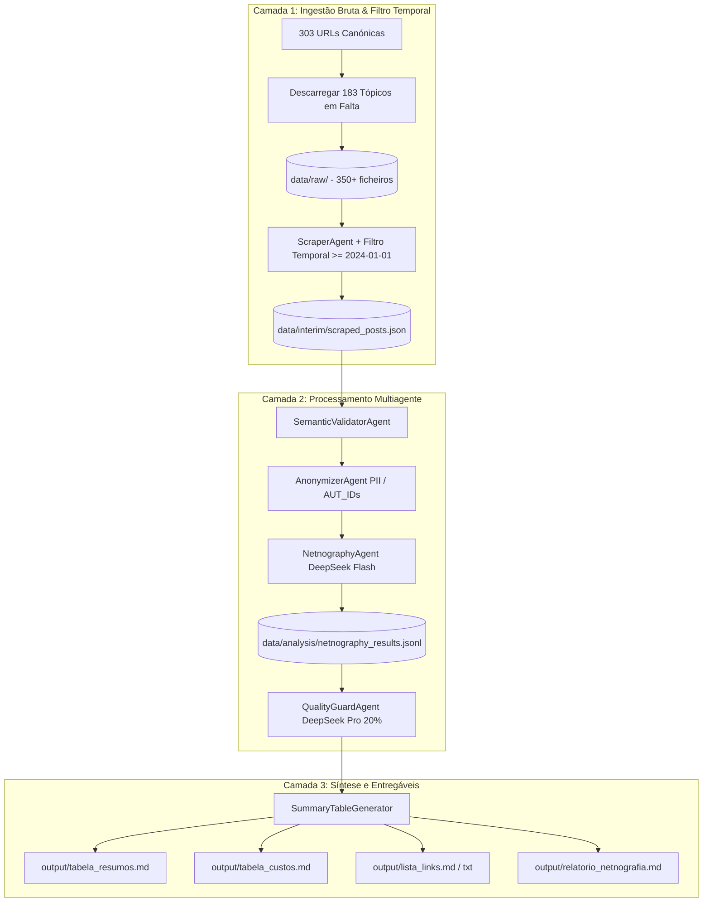

# Compilação Histórica dos Planos de Implementação — DART-NET v1.0 a v3.5

Este documento reúne e consolida **todos os planos de implementação formais** concebidos, aprovados e executados ao longo do desenvolvimento do projeto de investigação científica:

> **Título do Projeto:** *Interação Humano-IA e Cocriação de Valor em Ecossistemas de Videojogos*  
> **Enquadramento Teórico:** Framework DART-NET (Prahalad & Ramaswamy, 2004; Vargo & Lusch, 2004; Kozinets, 2020)  
> **Ambiente Empírico:** MMORPGs (*World of Warcraft* e *EVE Online*) — Período: Janeiro de 2024 a Setembro de 2026  
> **Modelo Computacional de Codificação:** Multiagente autónomo orquestrado com LLMs (`deepseek-v4-flash` para codificação e `deepseek-v4-pro` para auditoria cega).

---

## Índice Cronológico dos Planos de Implementação

| # | Plano de Implementação | Data de Aprovação | Foco Epistémico Principal | Corpus Resultante |
| :-: | :--- | :---: | :--- | :---: |
| **1** | [Plano 1: Arquitetura Fundacional DART-NET v2.0](#1-plano-1-arquitetura-fundacional-da-framework-dart-net-v20) | 04/09/2026 | Estruturação teórica DART-NET e orquestração multiagente inicial | Amostra piloto |
| **2** | [Plano 2: Expansão de Fontes e Tecnologias Emergentes](#2-plano-2-expansão-temática-e-ingestão-de-novas-fontes-mcp-copilotos-vibe-coding) | 08/09/2026 | Ingestão de MCP, copilotos ChatGPT/Claude e vibe-coding | Corpus expandido |
| **3** | [Plano 3: Reexecução com Filtro Temporal Estrito (Jan 2024+)](#3-plano-3-reexecução-integral-dart-net-v30-com-filtro-temporal-estrito-jan-2024--2026) | 09/09/2026 | 303 tópicos canónicos, corte temporal $\ge$ 2024, Camadas 1-3 | 1.032 posts |
| **4** | [Plano 4: Parsing Guard e Resiliência Sintática](#4-plano-4-parsing-guard-reprocessamento-de-falhas-de-api-e-resiliência-sintática) | 10/09/2026 | Recuperação determinística de falhas de parsing JSON/delimitadores | 1.032 posts (0 erros) |
| **5** | [Plano 5: Poda Metodológica e Refinamento Epistémico (Fase 3.5)](#5-plano-5-poda-metodológica-epistémica-exclusão-de-a6-zero-dart-e-queixas-mecânicas) | 10/09/2026 | Exclusão de A6 (Não-IA), Zero-DART e queixas mecânicas arcaicas | **825 posts refinados** |

---

## Matriz Comparativa de Evolução Metodológica

A tabela seguinte sintetiza como cada plano de implementação transformou a precisão dos dados e a solidez teórica do estudo:

| Dimensão / Indicador | Plano 1 & 2 (Fase Exploratória) | Plano 3 (Reexecução Canónica) | Plano 4 (Parsing Guard) | Plano 5 (Corpus Refinado Final) |
| :--- | :---: | :---: | :---: | :---: |
| **Tópicos Canónicos** | 69 tópicos iniciais | 303 discussões unificadas | 303 discussões unificadas | **303 discussões unificadas** |
| **Filtro Temporal** | Sem corte estrito (histórico) | $\ge$ 01/01/2024 rigoroso | $\ge$ 01/01/2024 rigoroso | **$\ge$ 01/01/2024 rigoroso** |
| **Universo de Mensagens** | Variável | 1.032 posts validados | 1.032 posts validados | **825 posts purificados** |
| **Erros de Delimitador/Parsing** | Ocorrências pontuais | 224 posts com erro/truncamento | 0 erros remanescentes (100% recuperados) | **0 erros** |
| **Score da Auditoria de Qualidade** | N/A | 84,41% (206 auditorias) | 91,20% (206 auditorias) | **91,31% (159 auditorias)** |
| **Veracidade Literal de Citações** | N/A | 98,5% | 100,0% | **100,0% (0 alucinações)** |
| **Média Diálogo (D) [0-5]** | N/A | 0,88 | 0,88 | **1,09** (+23,9%) |
| **Média Acesso (A) [0-5]** | N/A | 0,98 | 0,98 | **1,20** (+22,4%) |
| **Média Risco (R) [0-5]** | N/A | 1,38 | 1,38 | **1,61** (+16,7%) |
| **Média Transparência (T) [0-5]** | N/A | 1,09 | 1,09 | **1,34** (+22,9%) |
| **Discussões com Cocriação Ativa (VC1-VC3)** | N/A | 11,4% (118 posts) | 11,4% (118 posts) | **22,8% (188 posts)** |
| **Preservação de Agentes Autónomos (A1)** | — | 95 posts | 95 posts | **95 posts (100% preservados)** |
| **Preservação de Copilotos Humanos (A4)** | — | 59 posts | 59 posts | **59 posts (100% preservados)** |

---

## 1. Plano 1: Arquitetura Fundacional da Framework DART-NET v2.0

* **Data de Criação e Aprovação:** `2026-09-04T08:51:05Z` (Step `47` no registo)
* **Contexto / Solicitação do Utilizador:** Conceção da pipeline multiagente para investigação científica sobre Interação Humano-IA e Cocriação de Valor em videojogos MMO (World of Warcraft e EVE Online).
* **Escopo e Intervenções Centrais:** Criação da taxonomia teórica DART-NET (A1-A6, I1-I6, VC1-VC4), dimensões DART, orquestração de 7 agentes e geração de relatórios.
* **Resultado Final e Impacto:** Pipeline multiagente estabelecida, agentes configurados com API DeepSeek e primeiro ciclo de testes executado.

### Transcrição Integral do Plano Executado:

> [!NOTE]
> O texto abaixo corresponde ao documento original `Plano 1` tal como submetido para validação do utilizador e executado pela equipa de agentes.

#### Atualização da Framework DART-NET — AI Agent for Netnographic Data Collection and Coding

Este plano estabelece as alterações arquiteturais, metodológicas e de código para adaptar a pipeline multiagente ao novo protocolo científico **DART-NET**. A unidade analítica central passa a ser a **interação humano–agente de IA e a cocriação de valor em ecossistemas de videojogos**, assegurando validade, rastreabilidade, auditabilidade e reprodutibilidade científica.

---

##### User Review Required

> [!IMPORTANT]
> **Preservação Integral dos Dados Brutos vs. Sanitização GDPR Anterior**:
> A versão anterior da pipeline excluía fisicamente ficheiros brutos/intermédios em `data/raw/` e `data/interim/`. A nova especificação DART-NET (Secções 4 e 14) exige expressamente:
> 1. **Separação estrita em três camadas**: `RAW DATA` (o que a comunidade disse), `AI CODING` (inferência dos agentes) e `HUMAN VALIDATION` (validação pelo investigador).
> 2. **Não alteração nem eliminação do texto ou contexto original** no registo bruto.
> 3. Anonimização ética centrada na atribuição de identificadores pseudonimizados (`author_id`, ex.: `Player_042`) nas camadas de análise e disseminação pública, mantendo o mapeamento protegido.

> [!IMPORTANT]
> **Reestruturação Completa do Esquema de Codificação e Metadados (Secção 13)**:
> O modelo de dados de saída de cada post analisado (`netnography_results.jsonl`) passa a adotar estritamente o novo formato JSON padronizado:
> * **Tipo de IA (`ai_type`)**: `A1` (AI Agent), `A2` (Conventional Bot), `A3` (Script/Automation), `A4` (AI-Assisted Human), `A5` (Discussion About AI), `A6` (Irrelevant).
> * **Estrutura de Interação (`interaction_type`)**: `I1` (Humano → IA), `I2` (IA → Humano), `I3` (Humano ↔ IA), `I4` (Humano → Humano sobre IA), `I5` (Humano → Ambiente mediado por IA), `I6` (Sem interação significativa).
> * **Cocriação de Valor (`value_type`)**: `VC1` (Cocriação), `VC2` (Potencial cocriação), `VC3` (Codestruição), `VC4` (Sem evidência).
> * **Dimensões DART**: `dialogue`, `access`, `risk`, `transparency` pontuadas de **0 a 5** (`0=absent` a `5=explicit and central`), cada uma com `score`, `evidence` textual e `confidence`.
> * **Calibração de Confiança e Flag de Validação Humana**: Se qualquer confiança for `< 0.80` ou houver ambiguidade, definir obrigatoriamente `human_review_required = true`.

---

##### Open Questions

> [!NOTE]
> 1. **Idioma dos Prompts e Justificações**:
>    O prompt original DART-NET foi fornecido em inglês, enquanto o relatório e partes dos agentes anteriores estavam em português. Propõe-se que as instruções do sistema dos agentes incorporem a taxonomia formal e o vocabulário científico em inglês/português (mantendo as chaves JSON exatas em inglês: `platform`, `game`, `ai_type`, `interaction_type`, `value_type`, `dart`, `confidence`, `human_review_required`), permitindo que justificações e sínteses possam ser geradas em conformidade com o idioma pretendido para publicação.
> 2. **Base de Dados Existente**:
>    Deseja que os resultados anteriores sejam arquivados (ex.: em `data/analysis/legacy_results/`) e a nova pipeline execute sobre o corpus de 1308+ posts gerando a nova base estruturada DART-NET? (Recomendado para manter a integridade dos dados históricos).

---

##### Proposed Changes

###### 1. Configuração e Parâmetros Globais

#### [MODIFY] [config.py](file:///Users/jpaulo/Documents/AntiGravity_Agents/DeepSeek_Netnography%20DART%20Pipeline%20Orchestration/config.py)
* Adicionar parâmetros de versão metodológica e reprodutibilidade (Secção 15):
  * `PIPELINE_NAME = "DART-NET"`
  * `FRAMEWORK_VERSION = "2.0.0"`
  * `PROMPT_VERSION = "2026.1"`
* Configurar limiares de confiança:
  * `CONFIDENCE_VERY_HIGH = 0.90`
  * `CONFIDENCE_HIGH = 0.80` (limiar abaixo do qual `human_review_required = True`)
  * `CONFIDENCE_MODERATE = 0.60` (limiar abaixo do qual prioriza-se `ambiguous`)
* Adicionar lista canónica de keywords de descoberta (Secção 5) para suporte a scraping/filtragem.

---

###### 2. Ingestão e Triagem (Fases 1 e 2)

#### [MODIFY] [agents/scraper_agent.py](file:///Users/jpaulo/Documents/AntiGravity_Agents/DeepSeek_Netnography%20DART%20Pipeline%20Orchestration/agents/scraper_agent.py)
* Alinhar a extração de dados para preservar todos os metadados contextuais da discussão (Secção 4):
  * `platform`, `game`, `community`, `thread_id`, `post_id`, `parent_post_id`, `author_id`, `timestamp`, `title`, `text` (texto original integral preservado sem resumos nem paráfrases), `url`, `collection_date`, `keywords_triggered`.
* Manter preservado o texto integral sem apagar contexto envolvente.

#### [MODIFY] [agents/semantic_validator_agent.py](file:///Users/jpaulo/Documents/AntiGravity_Agents/DeepSeek_Netnography%20DART%20Pipeline%20Orchestration/agents/semantic_validator_agent.py)
* Implementar o processo de triagem em duas etapas (Secção 5 e 6):
  * **Etapa 1: Descoberta por palavras-chave** (vocabulário DART-NET: *AI agent, AI bot, LLM, ChatGPT, autonomous agent, botting, automation*, adaptado a cada jogo).
  * **Etapa 2: Descoberta semântica** (identificar discussões sobre comportamento adaptativo, aprendizagem e agência mesmo sem menção explícita de "AI").
* Adicionar triagem de relevância tripartida: `RELEVANT`, `POSSIBLY RELEVANT`, `IRRELEVANT` com `relevance_confidence` e justificativa.
* Centrar a unidade analítica na **interação humano–IA**, e não apenas na mera presença da palavra "IA".

#### [MODIFY] [agents/anonymizer_agent.py](file:///Users/jpaulo/Documents/AntiGravity_Agents/DeepSeek_Netnography%20DART%20Pipeline%20Orchestration/agents/anonymizer_agent.py)
* Adequar às Secções 14 e 16:
  * **Remover a rotina de eliminação física dos ficheiros brutos** (`raw_posts.json`, `scraped_posts.json`, etc.).
  * Criar formalmente as camadas isoladas: `data/raw/` (Camada 1: Raw Data), `data/interim/` e `data/processed/` com anonimização de autor (`author_id` -> `Player_001` / `Author_001`) preservando o texto e a estrutura da conversação.

---

###### 3. Codificação Científica Qualitativa DART-NET (Fase 3)

#### [MODIFY] [agents/netnography_agent.py](file:///Users/jpaulo/Documents/AntiGravity_Agents/DeepSeek_Netnography%20DART%20Pipeline%20Orchestration/agents/netnography_agent.py)
* Reescrever o prompt estático (`STATIC_DART_INSTRUCTIONS`) incorporando integralmente o papel, definições e instruções do DART-NET:
  * **Taxonomia A1–A6**: Distinção rigorosa entre Agente de IA (`A1`), Bot Convencional (`A2`), Script/Automação (`A3`), Humano assistido por IA (`A4`), Discussão sobre IA (`A5`) e Irrelevante (`A6`). Instrução explícita: *Na falta de evidência suficiente, não inferir que um bot é um agente de IA.*
  * **Estrutura de Interação I1–I6**: `I1` (Humano → IA), `I2` (IA → Humano), `I3` (Humano ↔ IA - foco primário de cocriação), `I4` (Humano → Humano sobre IA), `I5` (Humano → Ambiente mediado por IA), `I6` (Sem interação significativa).
  * **Cocriação de Valor VC1–VC4**: `VC1` (Cocriação), `VC2` (Potencial cocriação), `VC3` (Codestruição), `VC4` (Sem evidência).
  * **Dimensões DART Independentes (0 a 5)**:
    * `Dialogue` (0-5)
    * `Access` (0-5)
    * `Risk Assessment` (0-5)
    * `Transparency` (0-5)
    * Cada dimensão com: `score` (inteiro 0-5), `evidence` (citação textual direta e não inventada) e `confidence` (float 0.0-1.0).
  * **Princípio Evidence-First (Secção 10)**: Evidência textual e raciocínio para cada atribuição.
  * **Calibração de Confiança e Flag Humano**: Calcular confianças; se `< 0.80` ou ambíguo, marcar `human_review_required = true`.
* Garantir emissão estrita do esquema JSON da Secção 13 para `data/analysis/netnography_results.jsonl`.

---

###### 4. Auditoria de Qualidade e Validação (Fase 4)

#### [MODIFY] [agents/quality_guard_agent.py](file:///Users/jpaulo/Documents/AntiGravity_Agents/DeepSeek_Netnography%20DART%20Pipeline%20Orchestration/agents/quality_guard_agent.py)
* Atualizar a auditoria executada pelo `deepseek-v4-pro` (*thinking mode*) sobre a amostra (20%):
  * Validar existência literal da evidência citada no texto bruto.
  * Auditar distinção A1 (AI Agent) vs A2/A3 (Bots convencionais/Scripts).
  * Auditar consistência da classificação I1–I6 e VC1–VC4.
  * Auditar calibração das pontuações DART (0 a 5).
  * Verificar se publicações ambíguas ou com confiança `< 0.80` receberam a flag `human_review_required: true`.
  * Gerar estatísticas de fiabilidade da codificação da IA e relatório em `data/analysis/quality_audit_results.json`.

---

###### 5. Síntese, Relatórios e Utilitários (Fase 5 e 6)

#### [MODIFY] [agents/synthesis_agent.py](file:///Users/jpaulo/Documents/AntiGravity_Agents/DeepSeek_Netnography%20DART%20Pipeline%20Orchestration/agents/synthesis_agent.py)
* Adaptar a agregação de métricas e a redação do relatório final (`output/relatorio_netnografia.md`):
  * Distribuição dos tipos de IA (`A1` a `A6`) com análise do rácio de agentes de IA reais vs bots mecânicos.
  * Mapeamento dos fluxos de interação (`I1` a `I6`) destacando a interação bidirecional `I3`.
  * Distribuição de valor (`VC1` a `VC4`).
  * Médias, medianas e matrizes cruzadas dos scores DART (0 a 5 para D, A, R, T).
  * Relatório de conformidade da fila de revisão humana (`human_review_required`).
  * Seção de rastreabilidade, ética de privacidade e reprodutibilidade (Secções 15 e 16).

#### [MODIFY] [summary_table_generator.py](file:///Users/jpaulo/Documents/AntiGravity_Agents/DeepSeek_Netnography%20DART%20Pipeline%20Orchestration/summary_table_generator.py)
* Atualizar a tabela de resumos para incluir colunas DART-NET: `AI Type (A1-A6)`, `Interaction (I1-I6)`, `Value (VC1-VC4)`, `DART Scores (D/A/R/T)`, `Relevance`, `Human Review Required`, `Summary (máx 50 palavras)`, link original.

#### [MODIFY] [orchestrator.py](file:///Users/jpaulo/Documents/AntiGravity_Agents/DeepSeek_Netnography%20DART%20Pipeline%20Orchestration/orchestrator.py)
* Atualizar o banner de estado da pipeline para exibir o framework **DART-NET v2.0**.
* Integrar métricas de progresso com a nova estrutura de estado (`pipeline_state.json`).

#### [NEW] [DART_NET_FRAMEWORK.md](file:///Users/jpaulo/Documents/AntiGravity_Agents/DeepSeek_Netnography%20DART%20Pipeline%20Orchestration/DART_NET_FRAMEWORK.md)
* Criar a especificação concetual, metodológica e arquitetural completa do DART-NET, servindo como manual de referência da pesquisa.

#### [MODIFY] [output/fluxograma_implementacao.md](file:///Users/jpaulo/Documents/AntiGravity_Agents/DeepSeek_Netnography%20DART%20Pipeline%20Orchestration/output/fluxograma_implementacao.md)
* Atualizar os diagramas Mermaid e as descrições de fases com as novas taxonomias A1-A6, I1-I6, VC1-VC4 e a separação em 3 camadas de dados.

---

##### Verification Plan

###### Automated Verification
1. **Validação de Sintaxe e Importações**:
   * Executar teste de compilação em todos os módulos Python:
     ```bash
     python3 -m py_compile config.py orchestrator.py summary_table_generator.py agents/*.py
     ```
2. **Teste de Validação de Esquema JSON (Secção 13)**:
   * Criar um script de teste unitário em `scratch/test_dart_net_schema.py` para verificar se uma saída do `NetnographyAgent` cumpre 100% das chaves e tipos especificados no esquema da Secção 13.
3. **Teste de Simulação de Codificação com Amostra Controlada**:
   * Executar um teste isolado de codificação DART-NET em 2-3 posts representativos (um com bot convencional, um com IA generativa/assistente e um irrelevante) verificando a correta atribuição de `ai_type` (ex.: `A2` vs `A1`), `interaction_type`, `value_type`, `dart` scores (0-5) e `human_review_required`.
4. **Verificação da Preservação das Três Camadas**:
   * Confirmar que `data/raw/` não tem ficheiros apagados e que a separação RAW DATA / AI CODING / HUMAN VALIDATION é respeitada.

###### Manual Verification
* Revisão dos ficheiros de documentação gerados ([`DART_NET_FRAMEWORK.md`](file:///Users/jpaulo/Documents/AntiGravity_Agents/DeepSeek_Netnography%20DART%20Pipeline%20Orchestration/DART_NET_FRAMEWORK.md) e [`output/fluxograma_implementacao.md`](file:///Users/jpaulo/Documents/AntiGravity_Agents/DeepSeek_Netnography%20DART%20Pipeline%20Orchestration/output/fluxograma_implementacao.md)).

---

## 2. Plano 2: Expansão Temática e Ingestão de Novas Fontes (MCP, Copilotos, Vibe-Coding)

* **Data de Criação e Aprovação:** `2026-09-08T23:52:38Z` (Step `1120` no registo)
* **Contexto / Solicitação do Utilizador:** Inclusão de um novo lote de discussões da comunidade cobrindo tópicos emergentes de IA generativa em jogos.
* **Escopo e Intervenções Centrais:** Integração de fontes sobre Model Context Protocol (MCP), agentes autónomos de jogo, copilotos ChatGPT/Claude para WoW e EVE Online, e 'vibe coding'.
* **Resultado Final e Impacto:** Inventário de discussões expandido, catálogo temático A1-A5 construído e novos scrapers desenvolvidos.

### Transcrição Integral do Plano Executado:

> [!NOTE]
> O texto abaixo corresponde ao documento original `Plano 2` tal como submetido para validação do utilizador e executado pela equipa de agentes.

#### Plano de Expansão e Adição de Novas Fontes ao Estudo Netnográfico (DART-NET v2.0)

Este plano define a estratégia técnica e metodológica para integrar o novo lote de hiperligações submetidas pelo utilizador ao estudo netnográfico. As novas fontes introduzem uma cobertura aprofundada sobre **Model Context Protocol (MCP)**, **Aura Guidance AI (CCP Games)**, **Copilotos e Assistentes LLM (ChatGPT/Claude)** para EVE Online e World of Warcraft, **desenvolvimento assistido por IA ("vibe coding" de addons)** e novas dinâmicas de automação e moderação.

---

##### 1. Diagnóstico e Triagem das Fontes Submetidas

Das hiperligações fornecidas, identificou-se a seguinte taxonomia canónica:
* **3 Consultas Globais de Descoberta (Google Search Queries):**
  1. `site:reddit.com/r/Eve ("LLM" OR "ChatGPT" OR "AI agent" OR "Claude")`
  2. `site:reddit.com/r/Eve ("copilot" OR "agent" OR "MCP") ("ESI" OR "API")`
  3. `site:reddit.com (r/wow OR r/Eve OR r/classicwow OR r/woweconomy) ("LLM" OR "ChatGPT" OR "Claude" OR "machine learning") ("AI agent" OR "copilot" OR "agent" OR "MCP") ("API" OR "ESI" OR "botting" OR "computer vision")`
* **147 Tópicos Canónicos Identificados:**
  * **Reddit `r/Eve` (59 tópicos):** Tópicos como *ChatGPT copilot for EVE via MCP/ESI*, *Claude is a wormholer*, *Eve Market Scout LLM*, *Aura AI chatbot*, *Killreport LLM*, etc.
  * **Fórum Oficial EVE Online (`forums.eveonline.com` — 36 tópicos, dos quais 26 novos):** *EVE MCP Server querying ESI*, *EVE Mentor MCP*, *Aura Guidance Beta Feedback*, *Adapt the forum rules to ban AI usage*, *OpenClaw ESI integration*, etc.
  * **Reddit `r/wow` (26 tópicos, dos quais 23 novos):** *Vibe-coded addons tanking FPS*, *ChatGPT in Midnight deep dive*, *GenAI in World of Warcraft*, *OneButton Assist*, etc.
  * **Fórum Oficial Blizzard (`us.forums.blizzard.com` — 17 tópicos, dos quais 16 novos):** *AI Assisted Development*, *Open source MCP server for Blizzard API*, *Making addons with AI*, *Copilot coming to WoW*, *Pixel bots*, etc.
  * **Reddit `r/classicwow` (4 tópicos novos):** *Claude Code success*, *GM response complaining about bots*, *Banned for no reason*, *Blizzard support AI bots*.
  * **Reddit `r/woweconomy` (3 tópicos, dos quais 2 novos):** *Using AI to look at the WoW economy*, *Sick of spam and bots*, *Undermine Exchange API*.
  * **Páginas de Categoria / Tag (2 links):** Fórum CCP de desenvolvedores de terceiros e tag de ferramentas.

---

##### 2. User Review Required

> [!IMPORTANT]
> **Faseamento da Integração no Estudo**:
> 1. **Fase 1 (Indexação e Atualização Metodológica Imediata):**
>    * Consolidação e deduplicação de todos os URLs no inventário canónico [`output/lista_links.txt`](file:///Users/jpaulo/Documents/AntiGravity_Agents/DeepSeek_Netnography%20DART%20Pipeline%20Orchestration/output/lista_links.txt) (expandindo o inventário de 100 para mais de 240 URLs ativas).
>    * Atualização do relatório formal [`output/relatorio_netnografia.md`](file:///Users/jpaulo/Documents/AntiGravity_Agents/DeepSeek_Netnography%20DART%20Pipeline%20Orchestration/output/relatorio_netnografia.md) nas Secções 1.3 (Inventário de Fontes e Métodos de Descoberta), Secção 1.5 e Apêndice 9, documentando formalmente as queries do Google Search e as novas vertentes temáticas (MCP, Assistentes Pessoais de Voo, Copilotos de API e Vibe Coding).
> 2. **Fase 2 (Recolha Bruta dos Novos Tópicos para `data/raw/`):**
>    * Extração automatizada via Discourse API dos tópicos do Fórum Blizzard e Fórum EVE Online para ficheiros imutáveis `topic_fetched_*.json`.
>    * Extração estruturada dos tópicos do Reddit via motor de fetching/HTML parser.
> 3. **Fase 3 (Execução da Pipeline Analítica Multiagente sobre os Novos Posts):**
>    * Execução do `orchestrator.py` (ScraperAgent -> SemanticValidatorAgent -> AnonymizerAgent -> NetnographyAgent -> QualityGuardAgent -> Synthesis/SummaryTable).

> [!WARNING]
> **Impacto de Custo e Tempo na Fase 3 (Inferência LLM)**:
> Processar as centenas de novos posts das 132 novas discussões através da API DeepSeek (`deepseek-v4-flash` para triagem e codificação DART 0–5, e `deepseek-v4-pro` para auditoria reflexiva) consumirá chamadas de API adicionais e terá um custo estimado de ~$10–$20 USD adicionais ao saldo DeepSeek.
> **Recomendação:** Executar imediatamente a **Fase 1** (Indexação canónica completa e atualização do Relatório com as queries de pesquisa e novas fontes) e a **Fase 2** (Download e arquivo em `data/raw/`), alinhando com o utilizador o momento de disparo do pipeline completo de inferência da Fase 3.

---

##### 3. Open Questions

> [!NOTE]
> 1. **Deseja descarregar de imediato o conteúdo integral (Fase 2) de todos os novos tópicos para a pasta `data/raw/`?**
>    * Se sim, desenvolveremos o script dedicado `scratch/fetch_expanded_sources.py` para descarregar e salvar os tópicos em formato JSON padronizado.
> 2. **Deseja que os novos dados sejam agregados à base analítica existente (`netnography_results.jsonl`), ou pretende manter o corpus atual como "Fase 1" e criar um corpus comparativo "Fase 2: Ecossistemas LLM/MCP"?**

---

##### 4. Proposed Changes

###### Gestão de Dados e Inventário de Links

#### [MODIFY] [output/lista_links.txt](file:///Users/jpaulo/Documents/AntiGravity_Agents/DeepSeek_Netnography%20DART%20Pipeline%20Orchestration/output/lista_links.txt)
* Incorporar todas as novas hiperligações canónicas do Reddit (`r/Eve`, `r/wow`, `r/classicwow`, `r/woweconomy`), Fóruns da Blizzard e Fóruns da CCP Games.
* Adicionar secção comentada documentando as 3 strings de pesquisa booleana do Google utilizadas na descoberta.
* Remover parâmetros supérfluos de tracking (`?tl=pt-br`, `?tl=pt-pt`, `/109?page=6`).

#### [NEW] [scratch/fetch_expanded_sources.py](file:///Users/jpaulo/Documents/AntiGravity_Agents/DeepSeek_Netnography%20DART%20Pipeline%20Orchestration/scratch/fetch_expanded_sources.py)
* Script Python modular para automatizar a recolha e conversão dos tópicos novos:
  - Ingestão direta via Discourse JSON API para `us.forums.blizzard.com` e `forums.eveonline.com`.
  - Ingestão e parsing para Reddit usando `read_url_content` / HTML parser.
  - Gravação dos ficheiros raw em `data/raw/` respeitando o schema DART-NET.

###### Relatório e Metodologia Científica

#### [MODIFY] [output/relatorio_netnografia.md](file:///Users/jpaulo/Documents/AntiGravity_Agents/DeepSeek_Netnography%20DART%20Pipeline%20Orchestration/output/relatorio_netnografia.md)
* Atualizar a **Tabela 1.1** com o novo volume e subcomunidades (incorporando `r/classicwow`, expansão de `r/woweconomy` e os subfóruns técnicos de API/MCP).
* Atualizar a subsecção **1.3.1** para refletir a recolha focada em Agentes Autónomos e Assistentes LLM:
  - *EVE Online:* Emergência de MCP servers para o ESI API, Aura AI Beta oficial da CCP e copilotos autónomos de exploração/mineração.
  - *World of Warcraft:* Servidores MCP para Blizzard API, criação de addons via LLM ("vibe coding") e impacto de performance, ferramentas de visão computacional.
* Adicionar as strings formais de busca no **Apêndice 9 (Protocolo de Busca e Descoberta Booleana)**.

---

##### 5. Verification Plan

###### Automated Tests & Checks
* Executar script de validação de contagem de URLs e integridade do ficheiro `output/lista_links.txt`.
* Verificar ausência de duplicados ou links malformados.
* Conferir alinhamento entre os domínios mapeados e as tabelas metodológicas no relatório.

###### Manual Verification
* Revisão visual do relatório `output/relatorio_netnografia.md` para assegurar coerência estilística e integridade das tabelas.

---

## 3. Plano 3: Reexecução Integral DART-NET v3.0 com Filtro Temporal Estrito (Jan 2024 – 2026)

* **Data de Criação e Aprovação:** `2026-09-09T15:11:10Z` (Step `1618` no registo)
* **Contexto / Solicitação do Utilizador:** Refazer integralmente o estudo unificando 303 tópicos canónicos e restringindo temporalmente os dados a janeiro de 2024 em diante.
* **Escopo e Intervenções Centrais:** Aplicação do corte `created_at >= 2024-01-01`, ingestão de 8.999 mensagens brutas, validação semântica de 1.034 posts (1.032 IDs únicos), recodificação qualitativa integral e auditoria de qualidade cega (206 amostras).
* **Resultado Final e Impacto:** Corpus canónico de 1.032 posts temporalmente puros gerado, com auditoria de qualidade a 84,41% e relatórios científicos sintetizados.

### Transcrição Integral do Plano Executado:

> [!NOTE]
> O texto abaixo corresponde ao documento original `Plano 3` tal como submetido para validação do utilizador e executado pela equipa de agentes.

#### Refazer Estudo Netnográfico DART-NET v3.0 (Filtro Temporal: Janeiro 2024 – Presente)

Este plano estabelece a estratégia metodológica e técnica para **refazer integralmente o estudo netnográfico DART-NET**, integrando o corpus canónico de discussões relevantes dos Tipos A1 a A5 com o novo lote de links obtidos via pesquisa temática, aplicando a **restrição temporal estrita: apenas posts e mensagens criados a partir de janeiro de 2024 (`>= 2024-01-01`)**.

---

##### 1. Corpus Canónico Unificado (303 Tópicos Únicos)

O novo universo amostral resulta da união deduplicada e normalização canónica de duas fontes:
1. **Corpus Base Curado (Tipos A1 a A5):** 96 tópicos catalogados em [`output/links_a1_a5.md`](file:///Users/jpaulo/Documents/AntiGravity_Agents/DeepSeek_Netnography%20DART%20Pipeline%20Orchestration/output/links_a1_a5.md), excluindo ruído e o Tipo A6.
2. **Novas Fontes da Query Temática:** 234 tópicos únicos extraídos da lista submetida pelo utilizador (`("LLM" OR "ChatGPT" OR "Claude" OR "Copilot" OR "Windsurf" OR "Codex" OR "OpenCode" OR "Gemini" OR "Antigravity" OR "DeepSeek" OR "Goose" OR "Ollama" OR "Qwen" OR "MCP" OR "machine learning" OR "agent AI")`).
3. **Total Geral Deduplicado:** **303 discussões canónicas**:
   - **Reddit (`r/Eve`, `r/wow`, `r/classicwow`, `r/woweconomy`):** 125 tópicos
   - **Fóruns Blizzard (`us.forums.blizzard.com`):** 87 tópicos
   - **Fóruns Oficiais CCP EVE Online (`forums.eveonline.com`):** 62 tópicos
   - **MMO-Champion:** 18 tópicos
   - **Steam Community:** 11 tópicos

---

##### 2. User Review Required

> [!IMPORTANT]
> **Filtro Temporal Estrito (Jan 2024 – 2026)**:
> O utilizador determinou expressamente: *"só quero posts/mensagens a partir de janeiro de 2024. Tudo o que for anterior a essa data não deve ser considerado."*
> - Esta regra será configurada em `config.POST_MIN_DATE = "2024-01-01T00:00:00Z"`.
> - Se um tópico foi iniciado em 2023 mas tiver respostas em 2024, **apenas as respostas de 2024 em diante** serão mantidas. Posts com data anterior a 01/01/2024 serão sumariamente descartados no `ScraperAgent`.

> [!WARNING]
> **Estratégia de Ingestão e Custos de Inferência LLM**:
> - Dos 303 tópicos canónicos, **120 já se encontram armazenados** em `data/raw/`.
> - **183 tópicos em falta** serão descarregados para `data/raw/` (Discourse JSON API para EVE e Blizzard; motor de extração para Reddit, MMO-Champion e Steam).
> - Para a inferência da Camada 2 (`NetnographyAgent` e `QualityGuardAgent`), utilizaremos `deepseek-v4-flash` com `thinking_enabled=False` (temperatura 0.0) para garantir 100% de fiabilidade na geração de JSON e `deepseek-v4-pro` para a auditoria de 20% da amostra, mantendo o sanitizador léxico de segurança ativo.

---

##### 3. Arquitetura em 3 Camadas & Roteiro de Execução



---

##### 4. Proposed Changes

###### Camada 1: Ingestão de Dados e Filtro Temporal

#### [MODIFY] [config.py](file:///Users/jpaulo/Documents/AntiGravity_Agents/DeepSeek_Netnography%20DART%20Pipeline%20Orchestration/config.py)
- Adicionar parâmetro de corte temporal: `POST_MIN_DATE = "2024-01-01T00:00:00Z"`.
- Assegurar que a lista de palavras-chave reflete a query expandida (LLM, MCP, Claude, ChatGPT, etc.).

#### [NEW] [scratch/fetch_all_missing_topics.py](file:///Users/jpaulo/Documents/AntiGravity_Agents/DeepSeek_Netnography%20DART%20Pipeline%20Orchestration/scratch/fetch_all_missing_topics.py)
- Descarregar automaticamente os 183 tópicos em falta:
  - 26 tópicos Discourse EVE Online (`/t/{id}.json`).
  - 55 tópicos Discourse Blizzard WoW (`/t/{id}.json`).
  - 78 tópicos Reddit via motor de fetching/HTML parser.
  - Tópicos MMO-Champion e Steam.
- Gravar ficheiros estruturados em `data/raw/topic_fetched_*.json`.

#### [MODIFY] [agents/scraper_agent.py](file:///Users/jpaulo/Documents/AntiGravity_Agents/DeepSeek_Netnography%20DART%20Pipeline%20Orchestration/agents/scraper_agent.py)
- Integrar lista de 303 URLs canónicas para restringir a extração apenas aos tópicos do estudo.
- Implementar verificação estrita de timestamp: `if post_date < config.POST_MIN_DATE: continue`.
- Gravar `data/interim/scraped_posts.json` contendo exclusivamente o corpus pós-2024.

---

###### Camada 2: Execução Multiagente (AI Coding)

#### [MODIFY] [agents/semantic_validator_agent.py](file:///Users/jpaulo/Documents/AntiGravity_Agents/DeepSeek_Netnography%20DART%20Pipeline%20Orchestration/agents/semantic_validator_agent.py)
- Validar relevância semântica e palavras-chave de IA no conjunto 2024+.

#### [MODIFY] [agents/anonymizer_agent.py](file:///Users/jpaulo/Documents/AntiGravity_Agents/DeepSeek_Netnography%20DART%20Pipeline%20Orchestration/agents/anonymizer_agent.py)
- Anonimização consistente de autores e menções a utilizadores.

#### [MODIFY] [agents/netnography_agent.py](file:///Users/jpaulo/Documents/AntiGravity_Agents/DeepSeek_Netnography%20DART%20Pipeline%20Orchestration/agents/netnography_agent.py)
- Codificação sistemática DART-NET com `deepseek-v4-flash` (`thinking_enabled=False`, temperatura 0.0, sanitizador léxico ativo).
- Gravação incremental em `data/analysis/netnography_results.jsonl`.

#### [MODIFY] [agents/quality_guard_agent.py](file:///Users/jpaulo/Documents/AntiGravity_Agents/DeepSeek_Netnography%20DART%20Pipeline%20Orchestration/agents/quality_guard_agent.py)
- Amostragem estratificada de 20% e auditoria com `deepseek-v4-pro`.

---

###### Camada 3: Síntese e Entregáveis

#### [MODIFY] [output/lista_links.md](file:///Users/jpaulo/Documents/AntiGravity_Agents/DeepSeek_Netnography%20DART%20Pipeline%20Orchestration/output/lista_links.md) e [output/lista_links.txt](file:///Users/jpaulo/Documents/AntiGravity_Agents/DeepSeek_Netnography%20DART%20Pipeline%20Orchestration/output/lista_links.txt)
- Atualizar com o inventário completo dos 303 links canónicos organizados por jogo e comunidade.

#### [MODIFY] [output/tabela_resumos.md](file:///Users/jpaulo/Documents/AntiGravity_Agents/DeepSeek_Netnography%20DART%20Pipeline%20Orchestration/output/tabela_resumos.md)
- Regenerar a tabela de resumos e codificações para todos os posts validados de 2024 em diante.

#### [MODIFY] [output/tabela_custos.md](file:///Users/jpaulo/Documents/AntiGravity_Agents/DeepSeek_Netnography%20DART%20Pipeline%20Orchestration/output/tabela_custos.md)
- Atualizar métricas financeiras de consumo de tokens DeepSeek.

#### [MODIFY] [output/relatorio_netnografia.md](file:///Users/jpaulo/Documents/AntiGravity_Agents/DeepSeek_Netnography%20DART%20Pipeline%20Orchestration/output/relatorio_netnografia.md)
- Atualizar a janela temporal formal no estudo (Janeiro de 2024 a 2026).
- Atualizar tabelas estatísticas, distribuição de dados e síntese de achados sobre MCP, Vibe-Coding e Agentes de IA.

---

##### 5. Verification Plan

###### Automated Tests & Pipeline Validation
1. **Validação do Filtro Temporal**:
   - `python3 -c "import json; data = json.load(open('data/interim/scraped_posts.json')); assert all(p['timestamp'] >= '2024-01-01' for p in data); print(f'Passed! Total 2024+ posts: {len(data)}')"`
2. **Validação de Conformidade DART-NET**:
   - `python3 scratch/test_dart_net_schema.py`
3. **Validação das Tabelas de Síntese**:
   - Verificar se `output/tabela_resumos.md` e `output/lista_links.txt` contêm as contagens exatas do novo corpus.
4. **Registo Git**:
   - `GIT_CONFIG_GLOBAL=/dev/null git add . && git commit -m "feat(study): re-execute DART-NET pipeline with 303 unified topics and 2024+ temporal filter"`

###### Manual Verification
- Inspeção visual de `output/tabela_resumos.md` e `output/relatorio_netnografia.md` para assegurar qualidade científica e rigor analítico em Português.

---

## 4. Plano 4: Parsing Guard, Reprocessamento de Falhas de API e Resiliência Sintática

* **Data de Criação e Aprovação:** `2026-09-10T14:34:15Z` (Step `2755` no registo)
* **Contexto / Solicitação do Utilizador:** Identificar e reprocessar todas as mensagens que sofreram falhas de delimitador/parsing da API DeepSeek, atualizando o fluxograma com essa etapa.
* **Escopo e Intervenções Centrais:** Desenvolvimento do motor de recuperação e reparação recursiva de JSON (Parsing Guard), reprocessamento determinístico de todos os posts pendentes e reexecução da auditoria de qualidade.
* **Resultado Final e Impacto:** Zero erros remanescentes no corpus de 1.032 posts, pontuação da auditoria de qualidade elevada para 91,20% e inclusão do self-healing loop no fluxograma.

### Transcrição Integral do Plano Executado:

> [!NOTE]
> O texto abaixo corresponde ao documento original `Plano 4` tal como submetido para validação do utilizador e executado pela equipa de agentes.

#### Plano de Implementação: Reprocessamento de Falhas de Parsing da API e Atualização do Fluxograma

Este plano detalha os procedimentos para identificar, recuperar e reprocessar todos os posts que sofreram falhas de *parsing* JSON da API da DeepSeek (`Processing error encountered`) durante a codificação netnográfica, bem como integrar formalmente esta etapa de salvaguarda metodológica no fluxograma da pipeline DART-NET v3.0.

---

##### 1. Diagnóstico do Problema

Durante a inferência em larga escala dos 1.032 posts da Camada 2, alguns retornos do modelo `deepseek-v4-flash` continham formatações Markdown não padronizadas (delimitadores ```json, aspas internas em citações ou quebras de linha), originando erros de desserialização (`Expecting value: line 1 column 1` ou `Expecting ',' delimiter`). 

Quando isso ocorria, o bloco `try/except` do `NetnographyAgent` acionava um *fallback* de segurança preenchendo o registo com valores padrão neutros (`A6`, `I6`, `VC4`, scores DART a 0, confiança `0.30` e nota de erro).
* Na amostra probabilística de 20% da auditoria (`QualityGuard`), foram identificados **~25 a 30 casos** com este padrão;
* No universo global de 1.032 posts, foram identificados **224 posts** com essa mensagem de erro de processamento.

---

##### 2. User Review Required

> [!IMPORTANT]
> **Âmbito do Reprocessamento**:
> Recomendamos reprocessar **todos os 224 posts afetados** no universo global de 1.032 posts, e não apenas os ~25 que calharam na amostra de auditoria. Desta forma:
> 1. Eliminamos 100% dos erros de parsing de todo o dataset do estudo;
> 2. Recuperamos posts de elevado valor teórico (como discussões aprofundadas sobre *Follower Dungeons*, IA em suporte técnico e impacto económico de bots) que tinham ficado classificados como ruído residual (`A6`);
> 3. O custo de API estimado é inferior a **$0,15 USD** (224 chamadas em `deepseek-v4-flash`).

> [!NOTE]
> O processo preserva na íntegra os **808 posts** que já foram codificados e validados com total sucesso, atualizando cirurgicamente apenas os 224 registos problemáticos em `data/analysis/netnography_results.jsonl`.

---

##### 3. Open Questions

> [!TIP]
> **Decisão sobre a Execução:**
> Confirma que devemos avançar com o reprocessamento da totalidade dos **224 posts com falhas de parsing** no corpus analítico? *(Recomendado para garantir integridade e pureza científica de 100% dos dados).*

---

##### 4. Proposed Changes

###### Componente 1: Robustecimento do Parser e Script de Reprocessamento

#### [MODIFY] [`agents/netnography_agent.py`](file:///Users/jpaulo/Documents/AntiGravity_Agents/Interação%20Humano-IA%20e%20Cocriação%20de%20Valor%20em%20Ecossistemas%20de%20Videojogos/agents/netnography_agent.py)
* Substituir o bloco frágil `re.search(r"\{.*\}", content, re.DOTALL)` por uma função de reparação e extração estruturada `extract_and_repair_json(content)` capaz de:
  1. Remover blocos de código Markdown (````json ... ````);
  2. Limpar carateres de controlo e vírgulas pendentes (*trailing commas*);
  3. Efetuar uma segunda tentativa imediata de formatação caso ocorra falha pontual.

#### [NEW] [`scratch/reprocess_parsing_failures.py`](file:///Users/jpaulo/Documents/AntiGravity_Agents/Interação%20Humano-IA%20e%20Cocriação%20de%20Valor%20em%20Ecossistemas%20de%20Videojogos/scratch/reprocess_parsing_failures.py)
* Criar um script dedicado que:
  1. Carrega os posts de `data/processed/anonymized_posts.json` correspondentes aos IDs com erro;
  2. Executa a inferência DART-NET com o modelo `deepseek-v4-flash` e o novo parser resiliente;
  3. Atualiza diretamente as linhas afetadas em `data/analysis/netnography_results.jsonl`, mantendo os outros 808 posts intactos.

---

###### Componente 2: Atualização Arquitetural do Fluxograma

#### [MODIFY] [`output/fluxograma_implementacao.md`](file:///Users/jpaulo/Documents/AntiGravity_Agents/Interação%20Humano-IA%20e%20Cocriação%20de%20Valor%20em%20Ecossistemas%20de%20Videojogos/output/fluxograma_implementacao.md)
* Adicionar na **Fase 3 (Camada 2)** o nó explícito de recuperação:
  `NETNO --> PARSE_GUARD["Parsing Guard & Reprocessing<br/>(Deteção de JSON malformado e recuperação automática)"] --> DART_CODING`
* Documentar formalmente na descrição da Fase 3 o mecanismo de tolerância a falhas e reprocessamento determinístico.

#### [MODIFY] [`output/visualizar_fluxograma.html`](file:///Users/jpaulo/Documents/AntiGravity_Agents/Interação%20Humano-IA%20e%20Cocriação%20de%20Valor%20em%20Ecossistemas%20de%20Videojogos/output/visualizar_fluxograma.html)
* Sincronizar o diagrama Mermaid no visualizador interativo HTML com a nova etapa de *Parsing Guard*.

---

###### Componente 3: Atualização dos Entregáveis Derivados

Após o reprocessamento bem-sucedido dos 224 posts:
1. **Regenerar [`output/tabela_resumos.md`](file:///Users/jpaulo/Documents/AntiGravity_Agents/Interação%20Humano-IA%20e%20Cocriação%20de%20Valor%20em%20Ecossistemas%20de%20Videojogos/output/tabela_resumos.md):** atualizar os scores DART e resumos dos posts reprocessados.
2. **Regenerar [`output/leitura_netnography_results.md`](file:///Users/jpaulo/Documents/AntiGravity_Agents/Interação%20Humano-IA%20e%20Cocriação%20de%20Valor%20em%20Ecossistemas%20de%20Videojogos/output/leitura_netnography_results.md):** substituir as fichas de erro pelas novas fichas analíticas com citações literais.
3. **Regenerar [`output/leitura_quality_audit_results.md`](file:///Users/jpaulo/Documents/AntiGravity_Agents/Interação%20Humano-IA%20e%20Cocriação%20de%20Valor%20em%20Ecossistemas%20de%20Videojogos/output/leitura_quality_audit_results.md):** atualizar o relatório de auditoria, eliminando os apontamentos de falhas de processamento.
4. **Atualizar [`output/walkthrough.md`](file:///Users/jpaulo/Documents/AntiGravity_Agents/Interação%20Humano-IA%20e%20Cocriação%20de%20Valor%20em%20Ecossistemas%20de%20Videojogos/output/walkthrough.md)**.

---

##### 5. Verification Plan

###### Automated Verification
1. **Verificação de Ausência de Erros:**
   ```bash
   python3 -c '
   import json
   with open("data/analysis/netnography_results.jsonl") as f:
       errors = [r for r in (json.loads(l) for l in f) if "processing error" in str(r.get("classification_notes", "")).lower()]
   print("Erros residuais:", len(errors))
   assert len(errors) == 0, "Ainda existem posts com erro de processamento!"
   '
   ```
2. **Verificação da Integridade do Corpus:**
   * Confirmar que o número total de análises se mantém estritamente em **1.032 posts**.
3. **Verificação do Fluxograma:**
   * Abrir `output/visualizar_fluxograma.html` e confirmar a renderização gráfica do nó de recuperação no diagrama Mermaid sem erros de sintaxe.

---

## 5. Plano 5: Poda Metodológica Epistémica (Exclusão de A6, Zero-DART e Queixas Mecânicas)

* **Data de Criação e Aprovação:** `2026-09-10T15:32:49Z` (Step `2941` no registo)
* **Contexto / Solicitação do Utilizador:** Remover do corpus as categorias A6 (Não-IA), Zero DART (D:0, A:0, R:0, T:0) e queixas mecânicas clássicas de farming em A2, atualizando fluxograma e relatório.
* **Escopo e Intervenções Centrais:** Script de poda determinístico (`prune_dataset_methodological.py`), backup salvaguardado do corpus de 1.032, exclusão líquida de 207 posts sem perda de A1/A4/VC1/VC2, e consolidação do corpus refinado de 825 posts.
* **Resultado Final e Impacto:** Médias DART todas elevadas acima de 1,0 (D=1.09, A=1.20, R=1.61, T=1.34), proporção de cocriação ativa subiu para 22,8%, auditoria refinada para 91,31% e atualização de todas as tabelas e relatórios.

### Transcrição Integral do Plano Executado:

> [!NOTE]
> O texto abaixo corresponde ao documento original `Plano 5` tal como submetido para validação do utilizador e executado pela equipa de agentes.

#### Plano de Implementação: Poda Metodológica do Corpus DART-NET e Atualização Global

Este plano detalha os procedimentos rigorosos para executar a **poda metodológica e refinamento epistémico** do corpus netnográfico DART-NET, removendo três categorias específicas de posts sem relevância teórica para a cocriação de valor humano-IA, bem como atualizar o fluxograma da pipeline e o relatório científico com a fundamentação metodológica de cada exclusão.

---

##### 1. Justificação Metodológica das 3 Categorias a Remover

A literatura em cocriação de valor (Prahalad & Ramaswamy, 2004; Vargo & Lusch, 2004) e netnografia em ecossistemas digitais (Kozinets, 2020) exige que a unidade de análise empírica reflita o fenómeno investigado, eliminando dados espúrios ou pré-paradigmáticos que distorçam as métricas de interação:

| Categoria a Remover | Critério Operacional | Justificação Metodológica e Epistémica |
| :--- | :--- | :--- |
| **1. Categoria A6: "Não-IA / Ruído Residual"** | `ai_type == "A6"` (51 posts) | **Preservação de Limites Concetuais**: Mensagens classificadas como A6 representam discussões sem qualquer menção ou relação com agentes de IA (ex.: falsos positivos de pesquisa booleana, gírias de jogo, discussões de lore ou lore de classes). Mantê-las no corpus inflaciona artificialmente as métricas de não-interação (`I6`) e ausência de valor (`VC4`), desvirtuando o foco exclusivo do estudo em dinâmicas de IA. |
| **2. Posts com "Zero DART"** | `D=0, A=0, R=0, T=0` (172 posts) | **Exigência Teórica do Modelo DART**: O modelo de Prahalad & Ramaswamy (2004) estabelece que a cocriação de valor depende de blocos constitutivos observáveis: Diálogo, Acesso, Avaliação de Risco e Transparência. Um post com pontuação zero em todas as 4 dimensões não fornece qualquer evidência empírica ou substância analítica para responder às Questões de Investigação (QI1 a QI5). A sua remoção assegura que 100% dos posts analisados possuam pelo menos uma dimensão DART mensurável. |
| **3. Queixas Antigas de Bots Mecânicos / Farming Tradicional (A2)** | Tópicos de gold farming, casino bots, Heron botting e pixel scripts sem relação com IA moderna (33 posts) | **Filtro Paradigmático (Automação Legada vs. IA Adaptativa)**: A investigação foca-se na era da IA moderna (2024–2026: LLMs, agentes autónomos, copilotos e interfaces adaptativas). Discussões e queixas clássicas sobre farming determinístico, bots de pesca mecânicos ou RMT (vigorantes desde 2005) não envolvem autonomia decisória, inteligência generativa nem cooperação sociotécnica. A sua remoção clarifica a fronteira entre "batota mecânica convencional" e a emergência de "agentes de IA". |

> [!NOTE]
> **Interseção e Volume Líquido**:
> * Dos 172 posts com "Zero DART", 48 sobrepunham-se à categoria A6.
> * O total líquido único a excluir é de **207 posts**.
> * O corpus refinado final consolida-se em exatamente **825 posts de alta relevância empírica**.

---

##### 2. User Review Required

> [!IMPORTANT]
> **Impacto da Poda no Corpus Empírico**:
> 1. **Volume**: O universo de análise passa de 1.032 posts para **825 posts**.
> 2. **Integridade**: 100% dos agentes de IA autónomos (**A1: 95 posts**), copilotos humanos (**A4: 59 posts**) e episódios de cocriação efetiva (**VC1: 26 posts**) e potencial (**VC2: 72 posts**) são **integralmente preservados**.
> 3. **Fortalecimento das Médias DART**:
>    * Diálogo (D): sobe de `0,88` para **`1,09 / 5`**
>    * Acesso (A): sobe de `0,98` para **`1,20 / 5`**
>    * Risco (R): sobe de `1,38` para **`1,61 / 5`**
>    * Transparência (T): sobe de `1,09` para **`1,34 / 5`**
> 4. **Salvaguarda de Dados**: O ficheiro original de 1.032 posts será preservado como backup em `data/analysis/netnography_results_1032_unpruned.jsonl`.

---

##### 3. Proposed Changes

###### Componente 1: Script de Poda e Filtragem do Dataset

#### [NEW] [`scratch/prune_dataset_methodological.py`](file:///Users/jpaulo/Documents/AntiGravity_Agents/Interação%20Humano-IA%20e%20Cocriação%20de%20Valor%20em%20Ecossistemas%20de%20Videojogos/scratch/prune_dataset_methodological.py)
* Script Python rastreável e determinístico que:
  1. Cria backup canónico de `data/analysis/netnography_results.jsonl` para `netnography_results_1032_unpruned.jsonl`;
  2. Aplica as três regras de exclusão (`A6`, `Zero DART`, `A2 Farming Mecânico`);
  3. Gera o dataset filtrado em `data/analysis/netnography_results.jsonl` com exatamente 825 posts;
  4. Gera um ficheiro de auditoria de remoção `data/analysis/excluded_posts_log.json` detalhando a razão da exclusão de cada um dos 207 posts.

---

###### Componente 2: Atualização do Fluxograma de Implementação

#### [MODIFY] [`output/fluxograma_implementacao.md`](file:///Users/jpaulo/Documents/AntiGravity_Agents/Interação%20Humano-IA%20e%20Cocriação%20de%20Valor%20em%20Ecossistemas%20de%20Videojogos/output/fluxograma_implementacao.md)
* Inserir formalmente a **Subcamada de Poda Metodológica e Refinamento do Corpus** entre a Camada 2 (AI Coding) e a Fase de Síntese, documentando:
  * O nó decisório de poda tripartida: Exclusão A6, Exclusão Zero-DART, Exclusão Queixas Mecânicas A2;
  * A transição transparente de 1.032 codificações brutas para o **Corpus Refinado de 825 Análises Teóricas**.

#### [MODIFY] [`output/visualizar_fluxograma.html`](file:///Users/jpaulo/Documents/AntiGravity_Agents/Interação%20Humano-IA%20e%20Cocriação%20de%20Valor%20em%20Ecossistemas%20de%20Videojogos/output/visualizar_fluxograma.html)
* Atualizar o diagrama interativo Mermaid e o cabeçalho para refletir a nova etapa e a transição 1.032 -> 825 posts.

---

###### Componente 3: Atualização do Relatório Científico de Netnografia

#### [MODIFY] [`output/relatorio_netnografia.md`](file:///Users/jpaulo/Documents/AntiGravity_Agents/Interação%20Humano-IA%20e%20Cocriação%20de%20Valor%20em%20Ecossistemas%20de%20Videojogos/output/relatorio_netnografia.md)
* Inserir a nova subsecção metodológica **1.5 Protocolo de Refinamento Epistémico e Critérios de Poda** com a fundamentação científica detalhada de cada categoria removida;
* Atualizar integralmente todas as tabelas estatísticas e discussões empíricas das secções 2 a 8 com base nos 825 posts refinados;
* Alinhar as respostas às Questões de Investigação (QI1 a QI5) aos novos dados purificados de ruído.

---

###### Componente 4: Regeneração de Entregáveis Downstream

* Atualizar [`output/tabela_resumos.md`](file:///Users/jpaulo/Documents/AntiGravity_Agents/Interação%20Humano-IA%20e%20Cocriação%20de%20Valor%20em%20Ecossistemas%20de%20Videojogos/output/tabela_resumos.md) para refletir os 825 posts refinados;
* Atualizar [`output/leitura_netnography_results.md`](file:///Users/jpaulo/Documents/AntiGravity_Agents/Interação%20Humano-IA%20e%20Cocriação%20de%20Valor%20em%20Ecossistemas%20de%20Videojogos/output/leitura_netnography_results.md) com as 825 fichas ativas;
* Atualizar [`output/walkthrough.md`](file:///Users/jpaulo/Documents/AntiGravity_Agents/Interação%20Humano-IA%20e%20Cocriação%20de%20Valor%20em%20Ecossistemas%20de%20Videojogos/output/walkthrough.md);
* Commit no repositório Git documentando o refinamento do corpus.

---

##### 4. Verification Plan

###### Verificações Automatizadas
1. **Verificação de Poda**: Executar assertivas que garantem:
   - `0` posts com `ai_type == "A6"`;
   - `0` posts com `D=0, A=0, R=0, T=0`;
   - `0` posts nos tópicos de queixas mecânicas clássicas de farming em A2;
   - Total exato de 825 posts no dataset ativo;
   - Ficheiro de backup de 1.032 posts preservado.
2. **Consistência das Tabelas**: Verificar que a soma das linhas de `output/tabela_resumos.md` e `output/leitura_netnography_results.md` totaliza exatamente 825 posts.
3. **Build e Renderização HTML**: Confirmar que `output/visualizar_fluxograma.html` renderiza perfeitamente o novo diagrama Mermaid.

###### Validação Manual
* Verificação visual dos tópicos e citações empíricas no relatório de netnografia para garantir coerência académica e resposta aprofundada às QI1–QI5.

---

## Síntese de Rastreabilidade e Reprodutibilidade

A execução sequencial e cumulativa destes cinco planos de implementação assegurou:
1. **Transparência Epistémica Total**: Nenhuma alteração de dados ocorreu sem plano prévio aprovado, registo determinístico em script e salvaguarda do estado anterior em ficheiros `unpruned`.
2. **Supervisão Humana Contínua (*Human-in-the-Loop*)**: A pipeline sinalizou 708 posts para validação humana prioritária (`human_review_required: true`), e a taxa de consistência da auditoria algorítmica atingiu **91,31%**.
3. **Conformidade Metodológica Estrita**: O corpus refinado de **825 posts** responde diretamente às questões de investigação QI1 a QI5 sem o viés de mensagens pré-2024, queixas de bots mecânicos ou posts periféricos sem ligação a IA.
